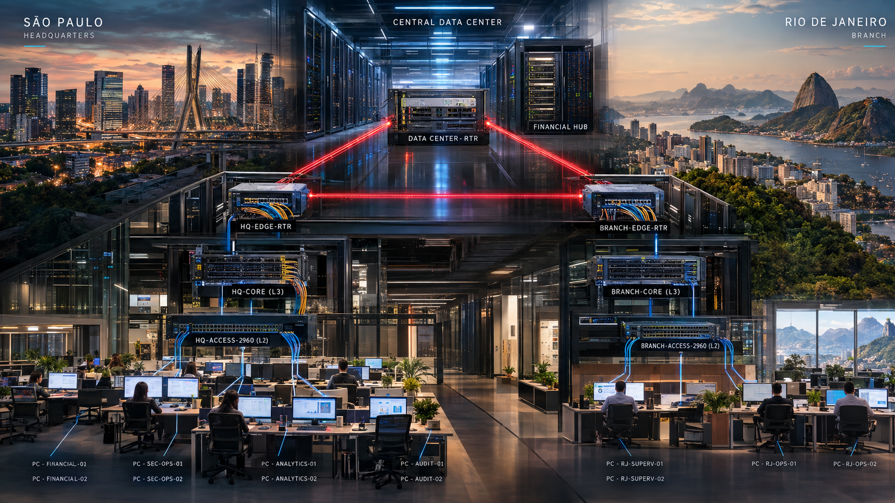
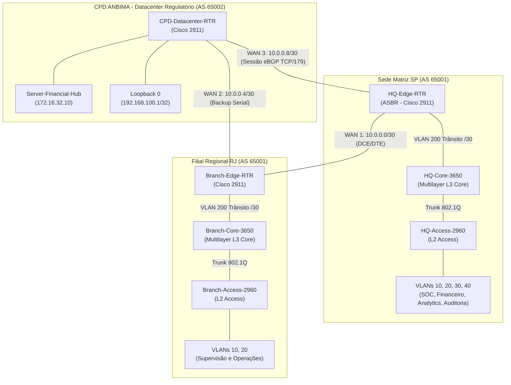

<p align="center">
  
</p>

# Arquitetura de Rede Corporativa Resiliente e Segmentada • ANBIMA Financial Hub

[](https://www.cisecurity.org/)
[](#-conformidade-regulatória-e-segurança-defensiva)
[](#)
[](#-engenharia-de-roteamento-h%C3%ADbrido-e-converg%C3%AAncia)

Implementação de uma infraestrutura de telecomunicações corporativa de alta disponibilidade e tolerância a falhas para o ecossistema financeiro da ANBIMA. O projeto abrange três sítios estratégicos — Matriz (São Paulo), Filial Regional (Rio de Janeiro) e CPD Regulatório/Datacenter de Contingência —, interconectados em uma topologia WAN em anel cíclico resiliente com roteamento híbrido multidomínio (IGP/EGP), redistribuição dinâmica de rotas, planos de contingência baseados em rotas estáticas flutuantes (AD 115) e comutação multicamada com isolamento estrito de Camada 2/3.

---

## 🏛️ Topologia Lógica e Arquitetura de Comunicação

A malha integra conectividade intra-sítio em Camada 3 de alta velocidade com interconexões seriais dedicadas (/30) em topologia fechada:




---

## ⚙️ Especificação Técnica dos Ativos de Rede

| Localidade | Dispositivo | Modelo de Hardware | Papel Operacional / Função |
| :--- | :--- | :--- | :--- |
| **Matriz SP** | `HQ-Edge-RTR` | Cisco 2911 (ASBR) | Roteador de borda, terminação WAN 1 e WAN 3, redistribuição OSPF ↔ BGP |
| **Matriz SP** | `HQ-Core-3650` | Cisco Catalyst 3650-24PS | Switch L3 Core, roteamento inter-VLAN por hardware (ASIC), servidor DHCP local |
| **Matriz SP** | `HQ-Access-2960` | Cisco Catalyst 2960-24TT | Comutação de acesso L2, segmentação de portas e uplink trunk 802.1Q |
| **Filial RJ** | `Branch-Edge-RTR` | Cisco 2911 | Borda regional, terminação WAN 1 e WAN 2, injeção de rotas estáticas flutuantes (AD 115) |
| **Filial RJ** | `Branch-Core-3650` | Cisco Catalyst 3650-24PS | Core L3 regional, terminação de SVIs e default routing para a borda |
| **Filial RJ** | `Branch-Access-2960` | Cisco Catalyst 2960-24TT | Comutação departamental regional L2 |
| **Datacenter** | `CPD-Datacenter-RTR` | Cisco 2911 | Borda de datacenter regulatório, peering eBGP com Matriz, terminação WAN 2 e 3 |
| **Datacenter** | `Server-Financial-Hub`| Cisco Server PT | Servidor de liquidação, banco de dados regulatório e DNS corporativo |

---

## 📐 Plano de Endereçamento, Supernetting e VLSM

A alocação de prefixos foi projetada com base nos blocos privados da RFC 1918, empregando Supernetting e Subnetting de alta densidade (/30 para enlaces e /22 e /23 para departamentos) para eliminar dispersão de endereços e permitir sumarização contínua.

### 1. Sede Matriz SP — Bloco Agregado `172.16.0.0/20` (Máscara: `255.255.240.0`)
*Capacidade do Bloco: 4.096 endereços IPv4 (`172.16.0.0` a `172.16.15.255`), particionado em blocos /22:*

| VLAN | Identificador | Sub-rede / CIDR | Máscara Decimal | Gateway SVI (Core 3650) | Escopo Dinâmico (Pool DHCP) | Broadcast |
| :--- | :--- | :--- | :--- | :--- | :--- | :--- |
| **10** | Segurança Operacional (SOC/NOC) | `172.16.0.0/22` | `255.255.252.0` | `172.16.0.1` | `172.16.0.51` - `172.16.3.254` | `172.16.3.255` |
| **20** | Financeiro e Liquidação | `172.16.4.0/22` | `255.255.252.0` | `172.16.4.1` | `172.16.4.51` - `172.16.7.254` | `172.16.7.255` |
| **30** | Dados de Mercado e Analytics | `172.16.8.0/22` | `255.255.252.0` | `172.16.8.1` | `172.16.8.51` - `172.16.11.254` | `172.16.11.255` |
| **40** | Auditoria e Compliance | `172.16.12.0/22` | `255.255.252.0` | `172.16.12.1` | `172.16.12.51` - `172.16.15.254` | `172.16.15.255` |
| **99** | Gerência Out-of-Band (Switches) | `172.16.99.0/24` | `255.255.255.0` | `172.16.99.1` | Endereçamento Estático (`172.16.99.2`) | `172.16.99.255` |
| **200**| Enlace de Trânsito L3 (Core-Edge)| `172.16.16.0/30` | `255.255.255.252`| `172.16.16.1` (Core) | `172.16.16.2` (RTR Gig0/0) | `172.16.16.3` |

> **Diretiva de Reserva Operacional DHCP:** Os primeiros 50 endereços úteis de cada sub-rede departamental (`.1` até `.50`) foram categoricamente excluídos via comando `ip dhcp excluded-address` para abrigar gateways, ativos fixos, servidores de monitoramento e interfaces de serviço.

### 2. Filial Regional RJ — Bloco Agregado `172.19.0.0/22` (Máscara: `255.255.252.0`)
*Capacidade do Bloco: 1.024 endereços IPv4 (`172.19.0.0` a `172.19.3.255`), particionado em blocos /23:*

| VLAN | Identificador | Sub-rede / CIDR | Máscara Decimal | Gateway SVI (Core RJ) | Escopo Dinâmico (Pool DHCP) | Broadcast |
| :--- | :--- | :--- | :--- | :--- | :--- | :--- |
| **10** | Supervisão Regional e Fiscalização | `172.19.0.0/23` | `255.255.254.0` | `172.19.0.1` | `172.19.0.51` - `172.19.1.254` | `172.19.1.255` |
| **20** | Operações Regionais e Negócios | `172.19.2.0/23` | `255.255.254.0` | `172.19.2.1` | `172.19.2.51` - `172.19.3.254` | `172.19.3.255` |
| **99** | Gerência Out-of-Band (Switches RJ)| `172.19.99.0/24` | `255.255.255.0` | `172.19.99.1` | Endereçamento Estático (`172.19.99.2`) | `172.19.99.255` |
| **200**| Enlace de Trânsito L3 (Core-Edge RJ)| `172.19.4.0/30` | `255.255.255.252`| `172.19.4.1` (Core) | `172.19.4.2` (RTR Gig0/0) | `172.19.4.3` |

### 3. CPD Regulatório e Malha WAN Ponto a Ponto (/30)

| Interface / Enlace | Finalidade Operacional | Sub-rede / CIDR | Ponta Local (IP / Interface) | Ponta Remota (IP / Interface) |
| :--- | :--- | :--- | :--- | :--- |
| **LAN CPD** | Servidores Centrais ANBIMA | `172.16.32.0/22` | `172.16.32.1` (CPD Gig0/0) | `172.16.32.10` (Server-Hub) |
| **Loopback 0** | BGP Keepalive & Peering Audit | `192.168.100.1/32` | `192.168.100.1` (CPD Loopback 0)| Interface Lógica Ininterrupta |
| **WAN 1** | Matriz SP ↔ Filial RJ | `10.0.0.0/30` | `10.0.0.1` (HQ Se0/3/0 - DCE) | `10.0.0.2` (RJ Se0/3/1 - DTE) |
| **WAN 2** | Filial RJ ↔ Datacenter CPD | `10.0.0.4/30` | `10.0.0.5` (RJ Se0/3/0 - DCE) | `10.0.0.6` (CPD Se0/3/1 - DTE) |
| **WAN 3** | Datacenter CPD ↔ Matriz SP | `10.0.0.8/30` | `10.0.0.9` (CPD Se0/3/0 - DCE)| `10.0.0.10` (HQ Se0/3/1 - DTE) |

---

## 🔀 Engenharia de Roteamento Híbrido e Convergência

A arquitetura resolve a separação entre redes locais e transporte interbancário operando múltiplos protocolos em cooperação:

### 1. Roteamento Interno: OSPFv2 (Área 0 - Backbone)
* **Algoritmo:** Shortest Path First (Dijkstra) com convergência atrelada à largura de banda real dos enlaces.
* **Escopo:** Executado nos Switches Multicamada Core e nos Roteadores de Borda de SP e RJ.
* **Trânsito L3 Dedicado:** A interconexão entre o Switch Core e o Roteador de Borda é feita por portas em modo Access alocadas na **VLAN 200** (/30). Isso suprime a necessidade de subinterfaces *Router-on-a-Stick*, descarregando o processador do roteador e mitigando contenções de broadcast no segmento corporativo.

### 2. Roteamento de Borda Exterior: eBGPv4
* **Sistemas Autônomos:** A infraestrutura corporativa (Matriz e Regional) opera sob o **AS Privado 65001**. O Datacenter Regulatório opera sob o **AS Privado 65002**.
* **Peering eBGP:** Estabelecido no enlace WAN 3 (`10.0.0.8/30`) via sessão TCP na porta 179 entre `HQ-Edge-RTR` e `CPD-Datacenter-RTR`.
* **Anúncio de Prefixos:** O roteador do CPD anuncia para o BGP a sub-rede de servidores de liquidação (`172.16.32.0/22`), a contingência WAN 2 (`10.0.0.4/30`) e o serviço ininterrupto da Loopback 0 (`192.168.100.1/32`).

### 3. Ponto de Integração: Redistribuição Mútua de Rotas
No roteador `HQ-Edge-RTR`, o tráfego converge através de conversão mútua de tabelas de roteamento:
```cisco
! Injeção de prefixos BGP (CPD) para a malha interna corporativa OSPF
router ospf 1
 router-id 2.2.2.2
 network 172.16.16.0 0.0.0.3 area 0
 network 10.0.0.0 0.0.0.3 area 0
 redistribute bgp 65001 subnets
exit

! Anuncio das sub-redes corporativas aprendidas via OSPF para o Datacenter via BGP
router bgp 65001
 neighbor 10.0.0.9 remote-as 65002
 network 172.16.0.0 mask 255.255.240.0
 redistribute ospf 1
exit
```

### 4. Resiliência por Rotas Flutuantes (Floating Static Routes - AD 115)
Como a Filial Regional (RJ) não executa BGP diretamente, sua contingência contra falhas no enlace primário WAN 1 opera por meio de rotas estáticas flutuantes apontando para o CPD via WAN 2 com **Distância Administrativa 115** (superior à AD do OSPF, que é 110):
```cisco
! No roteador Branch-Edge-RTR:
ip route 172.16.0.0 255.255.240.0 10.0.0.1 115
ip route 172.16.32.0 255.255.252.0 10.0.0.6 115
ip route 192.168.100.1 255.255.255.255 10.0.0.6 115
! Redistribuicao no OSPF local para alcancar o Switch Core da Regional
router ospf 1
 redistribute static subnets
exit
```
Em caso de rompimento físico ou perda de vizinhança OSPF na WAN 1, as rotas com AD 115 assumem a tabela de roteamento, garantindo comunicação com o Datacenter sem intervenção humana.

---

## 🛡️ Conformidade Regulatória e Segurança Defensiva

O ambiente foi configurado para cumprir as diretrizes de segurança da informação exigidas para instituições financeiras:

| Mecanismo de Hardening | Implementação Técnica | Controle / Conformidade |
| :--- | :--- | :--- |
| **Mitigação de Eavesdropping** | Telnet desativado globalmente (`transport input ssh`) e forçado `ip ssh version 2` | CIS Controls v8 (Safeguard 4.1) / BACEN 4.893 |
| **Criptografia Forte de Gerência** | Geração de chaves assimétricas RSA de 2048 bits com domínio institucional `anbima.corp` | ISO/IEC 27001 (A.10.1 - Controles Criptográficos) |
| **Proteção contra Brute Force** | Timeout de sessão inativa em 60s e limitação de 4 tentativas incorretas de login | NIST SP 800-53 (AC-7 Unsuccessful Logon Attempts) |
| **Integridade de Credenciais** | Utilização exclusiva de `enable secret` com algoritmo de dispersão (hash) irreversível | CIS Controls v8 (Safeguard 5.2) |
| **Segmentação Out-of-Band** | Criação da VLAN 99 isolada para gerenciamento IP dos switches de acesso L2 | CIS Controls v8 (Safeguard 12.2 - Arquitetura de Rede Segura) |
| **Prevenção de VLAN Hopping** | Desativação explícita de DTP com `switchport nonegotiate` e restrição estrita via `allowed vlan` | Mitigação de Ataques de Camada de Enlace |

---

## 🔬 Matriz de Testes e Validação Operacional

### 1. Convergência da Malha de Roteamento OSPF e Peering BGP
* Comando `show ip ospf neighbor` nos roteadores de borda confirmando adjacência em estado `FULL`.
* Comando `show ip bgp summary` no `HQ-Edge-RTR` e `CPD-Datacenter-RTR` confirmando estado da sessão eBGP estabelecido com troca contínua de prefixos.


### 2. Validação da Entrega Dinâmica de Parâmetros de Rede (DHCP Core)
* Disparo de solicitação DHCP a partir das estações de trabalho de cada VLAN.
* Comprovação de recebimento de IP útil a partir do `.51`, máscara correta (/22 ou /23), gateway apontando para a respectiva SVI e servidor DNS apontando categoricamente para o CPD (`172.16.32.10`).


### 3. Ensaio de Tolerância a Falhas WAN (Failover Test)
1. **Cenário Nominal:** Disparo de tráfego ICMP contínuo de `PC-RJ-Ops-01` (`172.19.2.51`) para o `Server-Financial-Hub` (`172.16.32.10`). Pacotes transitam pelo caminho preferencial WAN 1 (OSPF) até a Matriz e alcançam o CPD pela WAN 3.
2. **Injeção de Falha:** Desativação manual da interface serial `Se0/3/0` no `Branch-Edge-RTR` (`shutdown`).
3. **Convergência:** Perda transitória de apenas 1 a 2 pacotes ICMP durante o tempo de expiração do Dead Interval do OSPF. A rota flutuante com AD 115 é instalada e o tráfego é reencaminhado pela WAN 2 sem perda de serviço.


---

## 📁 Estrutura de Arquivos e Repositório

```text
├── assets/         # Evidências gráficas de testes, saídas de console e diagramas
├── configs/        # Scripts de configuração .ios de cada ativo e arquivo .pkt
├── docs/           # Engenharia de endereçamento, roteamento e Runbook de Operação
├── security/       # Matriz de conformidade BACEN/CIS e modelagem de ameaças
└── README.md       # Documentação executiva do projeto
```

---

## 👤 Autor e Contato

**Murilo Carlucci**  
*Graduando em Cibersegurança | FIAP Campus Paulista*  
* [LinkedIn](https://linkedin.com/in/[meu-usuario])  
* [GitHub](https://github.com/[meu-usuario])  
* E-mail: muricarlucci@gmail.com
