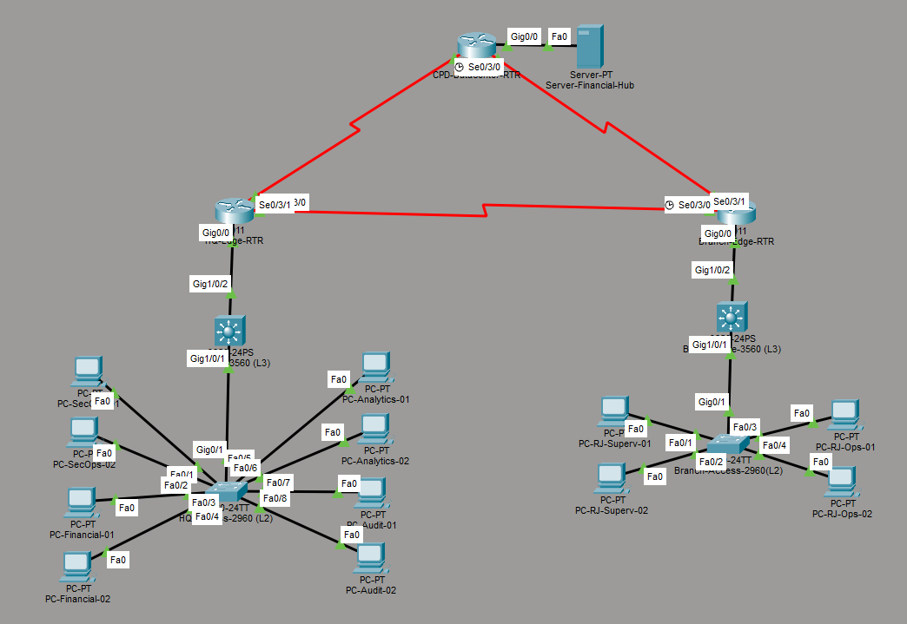

# Network Segmentation & Enterprise Routing Lab

> **Laboratório acadêmico de infraestrutura de redes corporativa multi-sítio desenvolvido no Cisco Packet Tracer, com segmentação por VLAN, switching de Camada 3, OSPF, eBGP, redistribuição de rotas, resiliência de WAN, DHCP e hardening de gerenciamento remoto.**

<p align="center">
  
</p>

<p align="center">
  <strong>ANBIMA-inspired Enterprise Network Simulation</strong><br>
  São Paulo (HQ) • Rio de Janeiro (Branch) • CPD Regulatório
</p>

---

## Sobre o projeto

Este repositório documenta uma simulação acadêmica de uma infraestrutura de rede corporativa multi-sítio inspirada em um cenário organizacional da ANBIMA.

O laboratório foi construído no **Cisco Packet Tracer** com o objetivo de representar, de forma integrada, uma arquitetura corporativa composta por:

- Matriz em São Paulo;
- Filial Regional no Rio de Janeiro;
- Datacenter / CPD Regulatório;
- WAN serial em topologia de anel;
- Segmentação lógica por VLAN;
- Switching de Camada 2 e Camada 3;
- Interfaces virtuais de switch (SVIs);
- DHCP distribuído nos switches Core;
- OSPFv2 em Área 0;
- eBGPv4 entre sistemas autônomos distintos;
- redistribuição entre OSPF e BGP;
- rotas estáticas de contingência;
- rotas estáticas flutuantes com AD 115;
- gerenciamento remoto utilizando exclusivamente SSHv2;
- autenticação local;
- chaves RSA de 2048 bits;
- controle de acesso às linhas VTY;
- temporização e limitação de tentativas de autenticação.

O projeto não representa a infraestrutura real da ANBIMA e não deve ser interpretado como documentação oficial, arquitetura produtiva ou auditoria da organização. Trata-se de uma **simulação acadêmica e de portfólio**, construída a partir de um cenário técnico fictício inspirado em uma infraestrutura corporativa regulatória.

---

# 1. Visão geral da arquitetura

A infraestrutura é organizada em três sítios estratégicos:

| Localidade | Função | Principais tecnologias |
|---|---|---|
| São Paulo — HQ | Matriz / núcleo corporativo | VLAN, L3 Switching, DHCP, OSPF, eBGP |
| Rio de Janeiro — Branch | Filial Regional | VLAN, L3 Switching, DHCP, OSPF, rotas de contingência |
| CPD Regulatório | Datacenter / Disaster Recovery | BGP, servidor central, Loopback, WAN |

A comunicação entre os três sítios utiliza uma **WAN serial em anel**, formada por três enlaces ponto a ponto /30:

```text
                    +-----------------------+
                    |   CPD REGULATÓRIO     |
                    |       AS 65002        |
                    |  CPD-Datacenter-RTR   |
                    +-----------+-----------+
                       WAN 3    |    WAN 2
                    10.0.0.8/30 | 10.0.0.4/30
                                |
                                |
             +------------------+------------------+
             |                                     |
             |                                     |
     +-------+--------+                     +------+--------+
     |   MATRIZ SP    |       WAN 1         | FILIAL RJ     |
     |     AS 65001   |---------------------|    AS 65001   |
     |  HQ-Edge-RTR   |    10.0.0.0/30      | Branch-Edge   |
     +-------+--------+                     +------+--------+
             |                                     |
        VLAN 200                              VLAN 200
        /30 transit                            /30 transit
             |                                     |
     +-------+--------+                     +------+--------+
     | HQ-Core-3650  |                     |Branch-Core-3650|
     |      L3       |                     |       L3       |
     +-------+--------+                     +------+--------+
             |                                     |
          802.1Q                                802.1Q
          Trunk                                  Trunk
             |                                     |
     +-------+--------+                     +------+--------+
     | HQ-Access-2960|                     |Branch-Access-2960|
     |      L2       |                     |        L2        |
     +----------------+                     +------------------+
