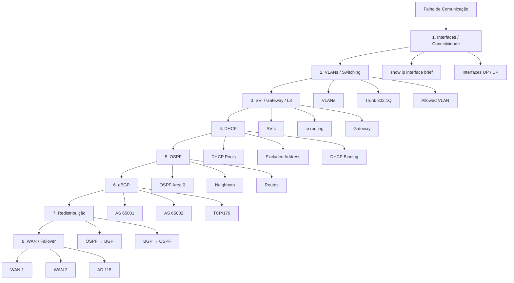

# Troubleshooting Runbook — Diagnóstico Operacional da Infraestrutura ANBIMA

[](#-5-diagnóstico-de-roteamento)
[](#-3-diagnóstico-de-vlans-e-trunks)
[](#-4-diagnóstico-do-dhcp)
[](#-6-diagnóstico-de-falhas-wan)

Runbook de diagnóstico da infraestrutura corporativa simulada da ANBIMA no Cisco Packet Tracer. Este documento organiza a identificação progressiva de falhas nas camadas física, de comutação, roteamento, serviços de rede, integração OSPF/eBGP, redistribuição de rotas e mecanismos de contingência WAN.

O diagnóstico considera os três sítios da arquitetura — **Matriz SP**, **Filial Regional RJ** e **CPD Regulatório/Datacenter** — utilizando os ativos, interfaces, VLANs, endereçamento e protocolos definidos no projeto.

---

## 🏛️ 1. Modelo de Diagnóstico Progressivo

O diagnóstico da infraestrutura segue uma abordagem de isolamento progressivo, partindo da camada mais próxima do ativo afetado e avançando até os mecanismos de roteamento e contingência.



### Ordem de isolamento

| Etapa | Camada             | Elemento principal   | Verificação                     |
| :---- | :----------------- | :------------------- | :------------------------------ |
| **1** | Física / Interface | Interfaces e enlaces | Estado `up/up`                  |
| **2** | L2                 | VLANs e trunks       | VLAN correta e trunk autorizado |
| **3** | L3 local           | SVIs e trânsito      | Gateway e interfaces L3         |
| **4** | Serviços           | DHCP                 | Pool, exclusões e lease         |
| **5** | IGP                | OSPFv2               | Adjacência e rotas              |
| **6** | EGP                | eBGPv4               | Peering e prefixos              |
| **7** | Integração         | Redistribuição       | Rotas entre OSPF/BGP            |
| **8** | Resiliência        | WAN 1 / WAN 2        | Contingência AD 115             |

---

# 🔎 2. Diagnóstico Inicial da Infraestrutura

Antes de investigar um protocolo específico, a primeira referência é o estado das interfaces dos equipamentos.

### Comando principal

```cisco
show ip interface brief
```

### Resultado esperado

As interfaces utilizadas pela arquitetura devem estar operacionalmente disponíveis conforme sua função.

### Interfaces principais

| Equipamento          | Interface   | Função               | Endereço           |
| :------------------- | :---------- | :------------------- | :----------------- |
| `HQ-Edge-RTR`        | `Gig0/0`    | Trânsito L3 com Core | `172.16.16.2/30`   |
| `HQ-Edge-RTR`        | `Se0/3/0`   | WAN 1 — RJ           | `10.0.0.1/30`      |
| `HQ-Edge-RTR`        | `Se0/3/1`   | WAN 3 — CPD          | `10.0.0.10/30`     |
| `HQ-Core-3650`       | `VLAN 10`   | SVI                  | `172.16.0.1/22`    |
| `HQ-Core-3650`       | `VLAN 20`   | SVI                  | `172.16.4.1/22`    |
| `HQ-Core-3650`       | `VLAN 30`   | SVI                  | `172.16.8.1/22`    |
| `HQ-Core-3650`       | `VLAN 40`   | SVI                  | `172.16.12.1/22`   |
| `HQ-Core-3650`       | `VLAN 99`   | Gerência             | `172.16.99.1/24`   |
| `HQ-Core-3650`       | `VLAN 200`  | Trânsito L3          | `172.16.16.1/30`   |
| `Branch-Edge-RTR`    | `Gig0/0`    | Trânsito L3 com Core | `172.19.4.2/30`    |
| `Branch-Edge-RTR`    | `Se0/3/1`   | WAN 1 — HQ           | `10.0.0.2/30`      |
| `Branch-Edge-RTR`    | `Se0/3/0`   | WAN 2 — CPD          | `10.0.0.5/30`      |
| `Branch-Core-3650`   | `VLAN 10`   | SVI                  | `172.19.0.1/23`    |
| `Branch-Core-3650`   | `VLAN 20`   | SVI                  | `172.19.2.1/23`    |
| `Branch-Core-3650`   | `VLAN 99`   | Gerência             | `172.19.99.1/24`   |
| `Branch-Core-3650`   | `VLAN 200`  | Trânsito L3          | `172.19.4.1/30`    |
| `CPD-Datacenter-RTR` | `Gig0/0`    | LAN CPD              | `172.16.32.1/22`   |
| `CPD-Datacenter-RTR` | `Loopback0` | Serviço de teste     | `192.168.100.1/32` |
| `CPD-Datacenter-RTR` | `Se0/3/0`   | WAN 3 — HQ           | `10.0.0.9/30`      |
| `CPD-Datacenter-RTR` | `Se0/3/1`   | WAN 2 — RJ           | `10.0.0.6/30`      |

---

# 🧩 3. Diagnóstico de VLANs e Trunks

Problemas de comunicação entre estações de uma mesma VLAN ou ausência de conectividade entre o Access e o Core devem ser investigados inicialmente na Camada 2.

## 3.1 VLANs da Matriz

| VLAN  | Segmento                         | Rede             |
| :---- | :------------------------------- | :--------------- |
| `10`  | Segurança Operacional / SOC-NOC  | `172.16.0.0/22`  |
| `20`  | Núcleo Financeiro e Liquidação   | `172.16.4.0/22`  |
| `30`  | Dados de Mercado e Analytics     | `172.16.8.0/22`  |
| `40`  | Auditoria e Compliance Normativo | `172.16.12.0/22` |
| `99`  | Gerência Out-of-Band             | `172.16.99.0/24` |
| `200` | Trânsito L3                      | `172.16.16.0/30` |

### Trunk Matriz

```text
HQ-Core-3650
Gig1/0/1
      │
      │ Trunk 802.1Q
      ▼
HQ-Access-2960
Gig0/1
```

VLANs permitidas:

```text
10,20,30,40,99
```

### Comandos de diagnóstico

```cisco
show vlan brief
show interfaces trunk
```

### Pontos de verificação

| Elemento         | Condição esperada |
| :--------------- | :---------------- |
| VLAN 10          | Presente          |
| VLAN 20          | Presente          |
| VLAN 30          | Presente          |
| VLAN 40          | Presente          |
| VLAN 99          | Presente          |
| Trunk            | Operacional       |
| VLANs permitidas | `10,20,30,40,99`  |
| Portas Fa0/1-2   | VLAN 10           |
| Portas Fa0/3-4   | VLAN 20           |
| Portas Fa0/5-6   | VLAN 30           |
| Portas Fa0/7-8   | VLAN 40           |

---

## 3.2 VLANs da Filial RJ

| VLAN  | Segmento                           | Rede             |
| :---- | :--------------------------------- | :--------------- |
| `10`  | Supervisão Regional e Fiscalização | `172.19.0.0/23`  |
| `20`  | Operações Regionais e Negócios     | `172.19.2.0/23`  |
| `99`  | Gerência Out-of-Band               | `172.19.99.0/24` |
| `200` | Trânsito L3                        | `172.19.4.0/30`  |

### Trunk RJ

```text
Branch-Core-3650
Gig1/0/1
      │
      │ Trunk 802.1Q
      ▼
Branch-Access-2960
Gig0/1
```

VLANs permitidas:

```text
10,20,99
```

### Comandos de diagnóstico

```cisco
show vlan brief
show interfaces trunk
```

### Pontos de verificação

| Elemento         | Condição esperada |
| :--------------- | :---------------- |
| VLAN 10          | Presente          |
| VLAN 20          | Presente          |
| VLAN 99          | Presente          |
| Trunk            | Operacional       |
| VLANs permitidas | `10,20,99`        |
| Portas Fa0/1-2   | VLAN 10           |
| Portas Fa0/3-4   | VLAN 20           |

A VLAN `200` é destinada ao trânsito L3 entre Core e roteador e não é utilizada como VLAN de usuários.

---

# 🌐 4. Diagnóstico do DHCP

Os Switches Core Catalyst 3650 funcionam como servidores DHCP locais.

A configuração reserva os primeiros 50 endereços de cada sub-rede departamental.

```text
.1 até .50
```

A distribuição dinâmica começa em:

```text
.51
```

## 4.1 DHCP da Matriz

### Pools

| Pool             | Rede             | Gateway       | DNS            |
| :--------------- | :--------------- | :------------ | :------------- |
| `POOL_SEC_OPS`   | `172.16.0.0/22`  | `172.16.0.1`  | `172.16.32.10` |
| `POOL_FINANCIAL` | `172.16.4.0/22`  | `172.16.4.1`  | `172.16.32.10` |
| `POOL_ANALYTICS` | `172.16.8.0/22`  | `172.16.8.1`  | `172.16.32.10` |
| `POOL_AUDIT`     | `172.16.12.0/22` | `172.16.12.1` | `172.16.32.10` |

### Comandos

```cisco
show ip dhcp pool
show ip dhcp binding
```

### Pontos de verificação

| Verificação                    | Referência do projeto  |
| :----------------------------- | :--------------------- |
| Pool VLAN 10                   | `POOL_SEC_OPS`         |
| Pool VLAN 20                   | `POOL_FINANCIAL`       |
| Pool VLAN 30                   | `POOL_ANALYTICS`       |
| Pool VLAN 40                   | `POOL_AUDIT`           |
| Primeiros endereços reservados | `.1` até `.50`         |
| Primeiro endereço dinâmico     | `.51`                  |
| Gateway                        | SVI da respectiva VLAN |
| DNS                            | `172.16.32.10`         |

---

## 4.2 DHCP da Filial RJ

### Pools

| Pool                 | Rede            | Gateway      | DNS            |
| :------------------- | :-------------- | :----------- | :------------- |
| `POOL_RJ_SUPERVISAO` | `172.19.0.0/23` | `172.19.0.1` | `172.16.32.10` |
| `POOL_RJ_OPERATIONS` | `172.19.2.0/23` | `172.19.2.1` | `172.16.32.10` |

### Comandos

```cisco
show ip dhcp pool
show ip dhcp binding
```

### Pontos de verificação

| Verificação                    | Referência do projeto |
| :----------------------------- | :-------------------- |
| Pool VLAN 10                   | `POOL_RJ_SUPERVISAO`  |
| Pool VLAN 20                   | `POOL_RJ_OPERATIONS`  |
| Primeiros endereços reservados | `.1` até `.50`        |
| Primeiro endereço dinâmico     | `.51`                 |
| Gateway VLAN 10                | `172.19.0.1`          |
| Gateway VLAN 20                | `172.19.2.1`          |
| DNS                            | `172.16.32.10`        |

### Sintomas e isolamento

| Sintoma                  | Verificação inicial                  |
| :----------------------- | :----------------------------------- |
| Host sem endereço IP     | VLAN da porta de acesso              |
| IP fora da sub-rede      | Pool DHCP correspondente             |
| Gateway incorreto        | `default-router` do pool             |
| DNS incorreto            | `dns-server` do pool                 |
| Nenhum lease             | `show ip dhcp binding`               |
| Endereço abaixo de `.51` | Verificar `ip dhcp excluded-address` |

---

# 🔀 5. Diagnóstico de Roteamento

A arquitetura utiliza OSPFv2 internamente e eBGPv4 para integração com o CPD.

O modelo de roteamento é:

```text
Matriz / Filial
AS 65001
     │
     │ OSPF Área 0
     │
HQ-Edge-RTR
     │
     │ eBGP TCP/179
     │
     ▼
CPD-Datacenter-RTR
AS 65002
```

---

## 5.1 Diagnóstico OSPFv2

O OSPF opera no **processo 1**, utilizando a **Área 0**.

### Comando principal

```cisco
show ip ospf neighbor
```

### Resultado esperado

As adjacências participantes devem alcançar o estado:

```text
FULL
```

### Router-IDs

| Equipamento        | Router-ID |
| :----------------- | :-------- |
| `HQ-Core-3650`     | `1.1.1.1` |
| `HQ-Edge-RTR`      | `2.2.2.2` |
| `Branch-Edge-RTR`  | `3.3.3.3` |
| `Branch-Core-3650` | `4.4.4.4` |

### Outros comandos de diagnóstico

```cisco
show ip ospf interface
show ip route
```

### Pontos de verificação

| Elemento    | Configuração     |
| :---------- | :--------------- |
| Processo    | `1`              |
| Área        | `0`              |
| Matriz      | OSPF             |
| Filial RJ   | OSPF             |
| Core SP     | OSPF             |
| Core RJ     | OSPF             |
| WAN 1       | `10.0.0.0/30`    |
| Trânsito SP | `172.16.16.0/30` |
| Trânsito RJ | `172.19.4.0/30`  |

### Sintomas

| Sintoma                    | Linha de investigação            |
| :------------------------- | :------------------------------- |
| Vizinho ausente            | Interface / endereço / rede OSPF |
| Vizinho não chega a `FULL` | Adjacência OSPF                  |
| Rota interna ausente       | Tabela OSPF / anúncio da rede    |
| Core sem destino remoto    | OSPF + trânsito L3               |
| WAN sem convergência       | Interface serial + OSPF          |

---

## 5.2 Diagnóstico do eBGP

O peering externo ocorre entre:

```text
Matriz: AS 65001
CPD:    AS 65002
```

A sessão utiliza a WAN 3:

```text
10.0.0.8/30
```

### Endereços do peering

```text
CPD-Datacenter-RTR
10.0.0.9
       │
       │ TCP/179
       │
10.0.0.10
HQ-Edge-RTR
```

### Comando principal

No `HQ-Edge-RTR`:

```cisco
show ip bgp summary
```

No `CPD-Datacenter-RTR`:

```cisco
show ip bgp summary
```

### Segundo comando

```cisco
show ip bgp
```

### Pontos de verificação

| Elemento    | Referência    |
| :---------- | :------------ |
| AS Matriz   | `65001`       |
| AS CPD      | `65002`       |
| Vizinho HQ  | `10.0.0.9`    |
| Vizinho CPD | `10.0.0.10`   |
| Porta       | TCP `179`     |
| WAN         | WAN 3         |
| Rede WAN 3  | `10.0.0.8/30` |

### Prefixos anunciados pelo CPD

| Prefixo            | Origem            |
| :----------------- | :---------------- |
| `172.16.32.0/22`   | LAN de servidores |
| `192.168.100.1/32` | Loopback 0        |
| `10.0.0.4/30`      | WAN 2             |

### Sintomas

| Sintoma                          | Linha de investigação        |
| :------------------------------- | :--------------------------- |
| Sessão não estabelecida          | WAN 3 / endereços / vizinho  |
| Sessão sem prefixos              | Configuração BGP             |
| Prefixo CPD ausente              | `show ip bgp`                |
| Rede corporativa ausente no CPD  | Redistribuição OSPF → BGP    |
| Comunicação com servidor ausente | BGP → OSPF / tabela de rotas |

---

# 🔁 6. Diagnóstico da Redistribuição de Rotas

O `HQ-Edge-RTR` é o ponto de integração entre OSPF e BGP.

```text
             HQ-Edge-RTR
                  │
        ┌─────────┴─────────┐
        │                   │
   OSPF → BGP          BGP → OSPF
        │                   │
        ▼                   ▼
 Redes Matriz          Redes CPD
        │                   │
        └─────────┬─────────┘
                  │
               WAN 3
                  │
                  ▼
          CPD-Datacenter-RTR
```

## 6.1 OSPF → BGP

A configuração do `HQ-Edge-RTR` utiliza:

```cisco
router bgp 65001
 neighbor 10.0.0.9 remote-as 65002
 redistribute ospf 1
exit
```

### Verificação

```cisco
show ip bgp
show ip route
```

As redes corporativas aprendidas via OSPF devem estar disponíveis para o domínio BGP.

---

## 6.2 BGP → OSPF

A configuração do `HQ-Edge-RTR` utiliza:

```cisco
router ospf 1
 redistribute bgp 65001 subnets
exit
```

### Verificação

```cisco
show ip route
```

As redes provenientes do CPD devem estar disponíveis no domínio OSPF.

### Sintoma principal

```text
BGP estabelecido
        +
prefixos recebidos
        +
rede ainda inacessível no Core
```

Nesse caso, a linha de investigação permanece na redistribuição entre os dois domínios.

---

# 🧭 7. Diagnóstico das Rotas Estáticas Flutuantes

A Filial RJ não executa BGP diretamente.

A contingência utiliza rotas estáticas com:

```text
AD 115
```

enquanto o OSPF utiliza:

```text
AD 110
```

As rotas configuradas no `Branch-Edge-RTR` são:

```cisco
ip route 172.16.0.0 255.255.240.0 10.0.0.1 115
ip route 172.16.99.0 255.255.255.0 10.0.0.1 115
ip route 172.16.32.0 255.255.252.0 10.0.0.6 115
ip route 192.168.100.1 255.255.255.255 10.0.0.6 115
```

### Diagnóstico da tabela

```cisco
show ip route
```

### Destinos de contingência

| Destino            | Próximo salto | Finalidade                  |
| :----------------- | :------------ | :-------------------------- |
| `172.16.0.0/20`    | `10.0.0.1`    | Bloco corporativo da Matriz |
| `172.16.99.0/24`   | `10.0.0.1`    | Gerência da Matriz          |
| `172.16.32.0/22`   | `10.0.0.6`    | LAN do CPD                  |
| `192.168.100.1/32` | `10.0.0.6`    | Loopback do CPD             |

### Redistribuição local

O `Branch-Edge-RTR` utiliza:

```cisco
router ospf 1
 redistribute static subnets
exit
```

O `Branch-Core-3650` possui rota padrão para:

```text
172.19.4.2
```

### Sintomas

| Sintoma                                 | Investigação                             |
| :-------------------------------------- | :--------------------------------------- |
| Filial perde acesso ao CPD              | WAN 1 / WAN 2 / rotas AD 115             |
| Core RJ não alcança destinos remotos    | Redistribuição das rotas estáticas       |
| Rota flutuante não aparece              | `show ip route`                          |
| Caminho de contingência não é utilizado | AD e disponibilidade do caminho primário |
| Retorno do CPD não chega à Filial       | Rotas estáticas de retorno no CPD        |

---

# 🚨 8. Diagnóstico de Falhas WAN

A infraestrutura possui três enlaces seriais em topologia de anel.

```text
                    WAN 3
             10.0.0.8/30
          ┌─────────────────┐
          │                 │
          ▼                 │
     MATRIZ SP ───────── CPD
          │                 ▲
          │                 │
       WAN 1             WAN 2
    10.0.0.0/30       10.0.0.4/30
          │                 │
          ▼                 │
       FILIAL RJ ───────────┘
```

### Distribuição dos enlaces

| WAN       | Enlace          | Ponta A              | Ponta B              |
| :-------- | :-------------- | :------------------- | :------------------- |
| **WAN 1** | Matriz ↔ Filial | `10.0.0.1` — HQ DCE  | `10.0.0.2` — RJ DTE  |
| **WAN 2** | Filial ↔ CPD    | `10.0.0.5` — RJ DCE  | `10.0.0.6` — CPD DTE |
| **WAN 3** | CPD ↔ Matriz    | `10.0.0.9` — CPD DCE | `10.0.0.10` — HQ DTE |

### Interfaces

| Equipamento          | Interface | Papel       |
| :------------------- | :-------- | :---------- |
| `HQ-Edge-RTR`        | `Se0/3/0` | WAN 1 — DCE |
| `HQ-Edge-RTR`        | `Se0/3/1` | WAN 3 — DTE |
| `Branch-Edge-RTR`    | `Se0/3/0` | WAN 2 — DCE |
| `Branch-Edge-RTR`    | `Se0/3/1` | WAN 1 — DTE |
| `CPD-Datacenter-RTR` | `Se0/3/0` | WAN 3 — DCE |
| `CPD-Datacenter-RTR` | `Se0/3/1` | WAN 2 — DTE |

### Comando inicial

```cisco
show ip interface brief
```

### Comandos complementares

```cisco
show ip route
show ip ospf neighbor
```

### Clock rate

As interfaces DCE utilizam:

```cisco
clock rate 64000
```

O padrão definido no projeto é:

| Interface DCE                | Clock   |
| :--------------------------- | :------ |
| `HQ-Edge-RTR Se0/3/0`        | `64000` |
| `Branch-Edge-RTR Se0/3/0`    | `64000` |
| `CPD-Datacenter-RTR Se0/3/0` | `64000` |

---

# 🔥 9. Diagnóstico do Failover WAN

O cenário utiliza a Filial RJ como ponto de demonstração da contingência.

### Caminho nominal

```text
PC-RJ-Ops-01
172.19.2.51
      │
      ▼
Branch-Access-2960
      │
      ▼
Branch-Core-3650
      │
      ▼
Branch-Edge-RTR
      │
      │ WAN 1
      ▼
HQ-Edge-RTR
      │
      │ WAN 3
      ▼
CPD-Datacenter-RTR
      │
      ▼
Server-Financial-Hub
172.16.32.10
```

### Teste de conectividade

Origem:

```text
PC-RJ-Ops-01
172.19.2.51
```

Destino:

```text
172.16.32.10
```

Comandos de diagnóstico:

```text
ping 172.16.32.10
```

e:

```text
tracert 172.16.32.10
```

### Condição de falha

A perda do enlace primário entre RJ e Matriz corresponde à indisponibilidade da:

```text
Branch-Edge-RTR
Se0/3/1
```

que representa a:

```text
WAN 1
10.0.0.0/30
```

A WAN 2 permanece disponível:

```text
Branch-Edge-RTR
10.0.0.5
        │
        │ WAN 2
        │ 10.0.0.4/30
        ▼
CPD-Datacenter-RTR
10.0.0.6
```

### Resultado esperado

Durante a convergência:

```text
Perda transitória:
1–2 pacotes ICMP
```

Após a convergência:

```text
WAN 1
   X
   │
   │ falha
   ▼

WAN 2
Branch ───────── CPD
10.0.0.5        10.0.0.6
```

As rotas estáticas com **AD 115** passam a fornecer a contingência para os destinos configurados.

---

# 🧪 10. Matriz de Sintomas e Diagnóstico

| Sintoma observado               | Primeira verificação    | Segunda verificação       | Domínio        |
| :------------------------------ | :---------------------- | :------------------------ | :------------- |
| PC sem IP                       | VLAN da porta           | DHCP Pool                 | L2 / DHCP      |
| PC recebe IP incorreto          | Pool DHCP               | SVI                       | DHCP / L3      |
| PC não alcança gateway          | VLAN / trunk            | SVI                       | L2 / L3        |
| VLAN não atravessa uplink       | `show interfaces trunk` | `allowed vlan`            | Switching      |
| Core não alcança roteador       | VLAN 200                | `show ip interface brief` | L3             |
| OSPF sem vizinho                | Interfaces              | `show ip ospf neighbor`   | OSPF           |
| OSPF não chega a `FULL`         | WAN / rede              | `show ip ospf interface`  | OSPF           |
| BGP não estabelece              | WAN 3                   | `show ip bgp summary`     | eBGP           |
| BGP estabelecido sem rotas      | BGP table               | Redistribuição            | BGP            |
| CPD inacessível pela Matriz     | BGP                     | OSPF                      | Redistribuição |
| CPD inacessível pela Filial     | WAN 1 / WAN 2           | AD 115                    | Resiliência    |
| Gerência do switch indisponível | VLAN 99                 | Gateway                   | OOB            |
| SSH indisponível                | IP de gerenciamento     | VTY / SSHv2               | Hardening      |

---

# 🧭 11. Fluxo de Diagnóstico por Camada

```text
                    ┌──────────────────────┐
                    │ Falha de comunicação │
                    └──────────┬───────────┘
                               │
                               ▼
                    ┌──────────────────────┐
                    │ Interfaces operantes?│
                    └──────────┬───────────┘
                               │
                    ┌──────────┴──────────┐
                    │                     │
                   NÃO                   SIM
                    │                     │
                    ▼                     ▼
              Interface / WAN       VLAN / Trunk
                                          │
                                          ▼
                                  SVI / Gateway / L3
                                          │
                                          ▼
                                      DHCP
                                          │
                                          ▼
                                        OSPF
                                          │
                                          ▼
                                        eBGP
                                          │
                                          ▼
                                  Redistribuição
                                          │
                                          ▼
                                    WAN / Failover
```

O princípio do runbook é evitar saltar diretamente para a investigação de BGP ou OSPF quando o problema ainda pode estar localizado em interfaces, VLANs, trunks, SVIs ou DHCP.

---

# 🔐 12. Diagnóstico de Gerenciamento SSHv2

Todos os **7 ativos gerenciáveis** possuem parâmetros de hardening definidos no cenário.

### Parâmetros

| Controle                | Configuração    |
| :---------------------- | :-------------- |
| Gerenciamento           | SSH             |
| Telnet                  | Desativado      |
| SSH                     | Versão 2        |
| RSA                     | `2048` bits     |
| Domínio                 | `ANBIMA.CORP`   |
| Usuário                 | `admin`         |
| Privilégio              | `15`            |
| Autenticação            | Local           |
| VTY                     | `0 4`           |
| Timeout                 | `60` segundos   |
| Tentativas              | `4`             |
| Credencial privilegiada | `enable secret` |
| Gerência                | VLAN `99`       |

### Configuração-base

```cisco
ip domain-name ANBIMA.CORP
crypto key generate rsa
2048
ip ssh version 2
username admin privilege 15 secret ANBIMA@SEC2026!

line vty 0 4
 login local
 transport input ssh
 ip ssh time-out 60
 ip ssh authentication-retries 4
exit
```

### Diagnóstico

Em caso de indisponibilidade do gerenciamento:

```text
1. Verificar endereço IP da VLAN 99
2. Verificar gateway da VLAN 99
3. Verificar conectividade L3
4. Verificar configuração das linhas VTY
5. Verificar SSHv2
```

### Endereços de gerenciamento

| Equipamento          | VLAN | Endereço         |
| :------------------- | :--- | :--------------- |
| `HQ-Access-2960`     | `99` | `172.16.99.2/24` |
| `Branch-Access-2960` | `99` | `172.19.99.2/24` |

---

# 📡 13. Diagnóstico de Endereçamento

## Matriz SP

| Elemento       | Endereço         |
| :------------- | :--------------- |
| Bloco agregado | `172.16.0.0/20`  |
| VLAN 10        | `172.16.0.0/22`  |
| VLAN 20        | `172.16.4.0/22`  |
| VLAN 30        | `172.16.8.0/22`  |
| VLAN 40        | `172.16.12.0/22` |
| VLAN 99        | `172.16.99.0/24` |
| VLAN 200       | `172.16.16.0/30` |

## Filial RJ

| Elemento       | Endereço         |
| :------------- | :--------------- |
| Bloco agregado | `172.19.0.0/22`  |
| VLAN 10        | `172.19.0.0/23`  |
| VLAN 20        | `172.19.2.0/23`  |
| VLAN 99        | `172.19.99.0/24` |
| VLAN 200       | `172.19.4.0/30`  |

## CPD

| Elemento             | Endereço           |
| :------------------- | :----------------- |
| LAN                  | `172.16.32.0/22`   |
| Gateway              | `172.16.32.1`      |
| Server-Financial-Hub | `172.16.32.10`     |
| Loopback 0           | `192.168.100.1/32` |

### Comando principal

```cisco
show ip route
```

A análise deve verificar se o destino procurado aparece na tabela e por qual mecanismo de roteamento ele foi aprendido.

---

# 🧪 14. Sequência Consolidada de Troubleshooting

A sequência de investigação utilizada como referência para a infraestrutura é:

```text
01 ── Identificar origem e destino da falha
      │
02 ── Verificar interfaces e enlaces
      │
03 ── Verificar VLANs e portas de acesso
      │
04 ── Verificar trunks 802.1Q
      │
05 ── Verificar SVIs e VLAN 200
      │
06 ── Verificar DHCP
      │
07 ── Verificar tabela de roteamento
      │
08 ── Verificar OSPF
      │
09 ── Verificar eBGP
      │
10 ── Verificar redistribuição OSPF ↔ BGP
      │
11 ── Verificar rotas estáticas AD 115
      │
12 ── Verificar WAN 1 / WAN 2 / WAN 3
      │
13 ── Confirmar conectividade ponta a ponta
```

---

# ✅ 15. Critérios de Encerramento do Diagnóstico

O incidente pode ser considerado isolado quando a cadeia correspondente estiver operacional novamente:

| Domínio            | Condição                                                                  |
| :----------------- | :------------------------------------------------------------------------ |
| **Interfaces**     | Enlaces necessários operacionalmente disponíveis                          |
| **VLANs**          | VLAN correta associada às portas                                          |
| **Trunks**         | VLANs homologadas transportadas                                           |
| **SVIs**           | Gateways correspondentes disponíveis                                      |
| **DHCP**           | Endereçamento dinâmico conforme o projeto                                 |
| **OSPF**           | Adjacências em `FULL`                                                     |
| **eBGP**           | Sessão entre AS `65001` e AS `65002` estabelecida                         |
| **Redistribuição** | Rotas disponíveis entre os domínios OSPF e BGP                            |
| **WAN**            | Caminho correspondente disponível                                         |
| **Failover**       | Rotas AD `115` disponíveis quando o caminho primário estiver indisponível |
| **CPD**            | `172.16.32.10` alcançável pelos caminhos previstos                        |
| **Gerenciamento**  | VLAN `99` e SSHv2 disponíveis nos switches de acesso                      |

---

# 📁 16. Referência Rápida de Comandos

## Interfaces

```cisco
show ip interface brief
```

## VLANs

```cisco
show vlan brief
```

## Trunks

```cisco
show interfaces trunk
```

## OSPF

```cisco
show ip ospf neighbor
show ip ospf interface
```

## BGP

```cisco
show ip bgp summary
show ip bgp
```

## Roteamento

```cisco
show ip route
```

## DHCP

```cisco
show ip dhcp pool
show ip dhcp binding
```

## Conectividade

```text
ping <endereço-destino>
tracert <endereço-destino>
```

---

## 📌 17. Referência Operacional da Infraestrutura

```text
                    ┌─────────────────────────┐
                    │       CPD ANBIMA        │
                    │       AS 65002          │
                    │ CPD-Datacenter-RTR      │
                    │ 172.16.32.1             │
                    └───────────┬─────────────┘
                                │
                           WAN 2 / WAN 3
                                │
               ┌────────────────┴────────────────┐
               │                                 │
        ┌──────▼───────┐                  ┌──────▼───────┐
        │   MATRIZ SP  │                  │ FILIAL RJ    │
        │   AS 65001   │                  │   AS 65001   │
        │ HQ-Edge-RTR  │────── WAN 1 ────│Branch-Edge   │
        └──────┬───────┘                  └──────┬───────┘
               │                                  │
          VLAN 200                           VLAN 200
               │                                  │
        ┌──────▼───────┐                  ┌──────▼───────┐
        │ HQ-Core-3650 │                  │Branch-Core   │
        │ 4 SVIs / DHCP│                  │2 SVIs / DHCP │
        └──────┬───────┘                  └──────┬───────┘
               │                                  │
             Trunk                              Trunk
               │                                  │
        ┌──────▼───────┐                  ┌──────▼───────┐
        │HQ-Access-2960│                  │Branch-Access │
        │ VLAN 10-40   │                  │ VLAN 10 / 20 │
        └──────────────┘                  └──────────────┘
```

Este runbook concentra a lógica de diagnóstico da infraestrutura documentada no projeto, permitindo correlacionar **sintomas**, **camadas**, **comandos de verificação**, **endereçamento**, **protocolos de roteamento** e **mecanismos de contingência** sem alterar a arquitetura definida no cenário.
