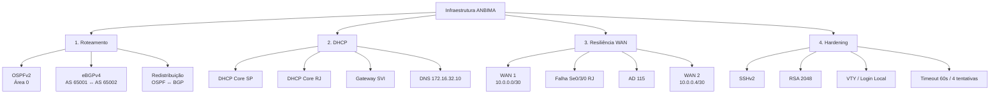

# Verification Playbook — Validação Operacional da Infraestrutura ANBIMA

[](#-1-convergência-da-malha-de-roteamento)
[](#-3-teste-de-tolerância-a-falhas-wan)
[](#-2-validação-do-dhcp-core)
[](#-4-validação-do-hardening)

Playbook de validação da infraestrutura corporativa simulada da ANBIMA no Cisco Packet Tracer. Este documento consolida os procedimentos de verificação da malha OSPF, do peering eBGP, da entrega dinâmica de endereçamento via DHCP, da redundância WAN por rotas estáticas flutuantes e dos mecanismos de hardening aplicados aos ativos gerenciáveis.

A validação considera os três sítios da arquitetura — **Matriz SP**, **Filial Regional RJ** e **CPD Regulatório/Datacenter** — e deve ser executada preservando a topologia, os endereços e os papéis definidos no projeto.

---

## 🏛️ 1. Visão Geral do Processo de Validação

A validação operacional segue quatro frentes principais:



### Ativos diretamente envolvidos

| Localidade     | Ativo                  | Modelo             | Função na validação                                      |
| :------------- | :--------------------- | :----------------- | :------------------------------------------------------- |
| **Matriz SP**  | `HQ-Edge-RTR`          | Cisco 2911         | OSPF, eBGP, redistribuição e terminação WAN 1/WAN 3      |
| **Matriz SP**  | `HQ-Core-3650`         | Catalyst 3650-24PS | SVIs, DHCP, OSPF e trânsito L3                           |
| **Matriz SP**  | `HQ-Access-2960`       | Catalyst 2960-24TT | VLANs, trunk 802.1Q e gerenciamento                      |
| **Filial RJ**  | `Branch-Edge-RTR`      | Cisco 2911         | OSPF, rotas flutuantes AD 115 e WAN 1/WAN 2              |
| **Filial RJ**  | `Branch-Core-3650`     | Catalyst 3650-24PS | SVIs, DHCP, OSPF e default route                         |
| **Filial RJ**  | `Branch-Access-2960`   | Catalyst 2960-24TT | VLANs, trunk 802.1Q e gerenciamento                      |
| **Datacenter** | `CPD-Datacenter-RTR`   | Cisco 2911         | eBGP, WAN 2/WAN 3, LAN CPD e Loopback 0                  |
| **Datacenter** | `Server-Financial-Hub` | Cisco Server PT    | Liquidação, banco de dados regulatório e DNS corporativo |

---

## 🔬 2. Matriz de Validação

| ID        | Domínio    | Elemento validado | Evidência esperada                                                 |
| :-------- | :--------- | :---------------- | :----------------------------------------------------------------- |
| **EV-01** | Routing    | OSPFv2            | Adjacências em estado `FULL`                                       |
| **EV-02** | Routing    | eBGPv4            | Sessão estabelecida e troca de prefixos                            |
| **EV-03** | Services   | DHCP Core         | IP iniciado em `.51`, máscara correta, gateway SVI e DNS do CPD    |
| **EV-04** | Resilience | Failover WAN      | Perda transitória de 1–2 pacotes e utilização da WAN 2             |
| **EV-05** | Security   | SSHv2             | Gerenciamento remoto protegido e parâmetros de hardening aplicados |

Os registros gráficos correspondentes devem ser armazenados em:

```text
assets/evidences/
├── ev-01-ospf-adjacency.png
├── ev-02-ebgp-peering-established.png
├── ev-03-dhcp-core-pools.png
├── ev-04-wan-failover-convergence.png
└── ev-05-hardening-sshv2.png
```

---

## 🔀 3. Convergência da Malha de Roteamento

### 3.1 OSPFv2 — Área 0

O OSPFv2 opera como protocolo interno da arquitetura, abrangendo os roteadores de borda e os Switches Core da Matriz e do Rio de Janeiro.

A validação deve confirmar a formação das adjacências entre os elementos participantes da Área 0.

### Comando de verificação

Executar nos roteadores de borda:

```cisco
show ip ospf neighbor
```

### Resultado esperado

A tabela de vizinhos deve apresentar as adjacências em estado:

```text
FULL
```

O estado `FULL` representa a adjacência operacional utilizada como referência no cenário para validar a convergência OSPF.

### Pontos de atenção

| Elemento          | Informação do projeto |
| :---------------- | :-------------------- |
| Processo OSPF     | `1`                   |
| Área              | `0`                   |
| Matriz Router-ID  | `2.2.2.2`             |
| Filial Router-ID  | `3.3.3.3`             |
| Core RJ Router-ID | `4.4.4.4`             |
| Core SP Router-ID | `1.1.1.1`             |
| WAN 1             | `10.0.0.0/30`         |
| WAN 2             | `10.0.0.4/30`         |
| Trânsito SP       | `172.16.16.0/30`      |
| Trânsito RJ       | `172.19.4.0/30`       |

---

### 3.2 eBGPv4 — Peering entre Matriz e CPD

O Datacenter opera em um Sistema Autônomo próprio:

```text
Matriz / Filial: AS 65001
CPD:             AS 65002
```

O peering externo ocorre através da **WAN 3**:

```text
WAN 3
10.0.0.8/30

CPD-Datacenter-RTR
10.0.0.9
       │
       │ TCP/179
       │
10.0.0.10
HQ-Edge-RTR
```

### Comandos de verificação

No `HQ-Edge-RTR`:

```cisco
show ip bgp summary
```

No `CPD-Datacenter-RTR`:

```cisco
show ip bgp summary
```

### Resultado esperado

A sessão eBGP deve aparecer como estabelecida, com troca de prefixos entre os dois Sistemas Autônomos.

A validação deve considerar especificamente:

* vizinho `10.0.0.9` no `HQ-Edge-RTR`;
* vizinho `10.0.0.10` no `CPD-Datacenter-RTR`;
* AS remoto `65002` no lado da Matriz;
* AS remoto `65001` no lado do CPD;
* sessão sobre a WAN 3;
* troca contínua de prefixos.

### Prefixos anunciados pelo CPD

O CPD anuncia para a Matriz:

| Prefixo            | Finalidade                                 |
| :----------------- | :----------------------------------------- |
| `172.16.32.0/22`   | LAN dos servidores centrais                |
| `10.0.0.4/30`      | Enlace de backup WAN 2                     |
| `192.168.100.1/32` | Loopback 0 / serviço ininterrupto de teste |

### Evidência

Salvar a captura da sessão estabelecida em:

```text
assets/evidences/ev-02-ebgp-peering-established.png
```

---

## 🔁 4. Validação da Redistribuição de Rotas

A arquitetura utiliza o `HQ-Edge-RTR` como ponto de integração entre os domínios OSPF e BGP.

### OSPF → BGP

As redes corporativas aprendidas pelo OSPF são anunciadas para o CPD através do BGP:

```cisco
router bgp 65001
 neighbor 10.0.0.9 remote-as 65002
 network 172.16.0.0 mask 255.255.240.0
 redistribute ospf 1
exit
```

### BGP → OSPF

As rotas provenientes do Datacenter são injetadas no domínio OSPF:

```cisco
router ospf 1
 router-id 2.2.2.2
 network 172.16.16.0 0.0.0.3 area 0
 network 10.0.0.0 0.0.0.3 area 0
 redistribute bgp 65001 subnets
exit
```

### Critério de validação

A comunicação entre as redes corporativas e a LAN do CPD deve permanecer possível sem exigir que os Switches Core executem BGP.

O modelo de integração é:

```text
                    ┌──────────────────────┐
                    │      HQ-Edge-RTR     │
                    │      ASBR / AS 65001 │
                    └──────────┬───────────┘
                               │
                 ┌─────────────┴─────────────┐
                 │                           │
          OSPF → BGP                    BGP → OSPF
                 │                           │
                 ▼                           ▼
          Redes corporativas           Redes do CPD
                 │                           │
                 └─────────────┬─────────────┘
                               │
                         WAN 3 / eBGP
                               │
                               ▼
                    CPD-Datacenter-RTR
                         AS 65002
```

---

## 🧭 5. Validação das Rotas Estáticas Flutuantes

A Filial RJ não executa BGP diretamente.

Sua contingência é construída através de rotas estáticas flutuantes com **AD 115**.

### Rotas configuradas no `Branch-Edge-RTR`

```cisco
ip route 172.16.0.0 255.255.240.0 10.0.0.1 115
ip route 172.16.99.0 255.255.255.0 10.0.0.1 115
ip route 172.16.32.0 255.255.252.0 10.0.0.6 115
ip route 192.168.100.1 255.255.255.255 10.0.0.6 115
```

### Destino das contingências

| Destino            | Próximo salto | Caminho     |
| :----------------- | :------------ | :---------- |
| `172.16.0.0/20`    | `10.0.0.1`    | Matriz SP   |
| `172.16.99.0/24`   | `10.0.0.1`    | Matriz SP   |
| `172.16.32.0/22`   | `10.0.0.6`    | CPD / WAN 2 |
| `192.168.100.1/32` | `10.0.0.6`    | CPD / WAN 2 |

As rotas possuem AD `115`, superior à AD `110` do OSPF. Dessa forma, permanecem como contingência enquanto o caminho OSPF preferencial estiver disponível.

### Redistribuição para o OSPF local

```cisco
router ospf 1
 redistribute static subnets
exit
```

Esse mecanismo permite que o `Branch-Core-3650` continue alcançando os destinos remotos através do roteador regional.

---

# 🚨 6. Teste de Tolerância a Falhas WAN

## 6.1 Objetivo

Validar a continuidade de comunicação entre a Filial RJ e o CPD após a perda do enlace primário entre a Filial e a Matriz.

O teste utiliza tráfego ICMP contínuo para observar a convergência da malha.

---

## 6.2 Cenário Nominal

Origem:

```text
PC-RJ-Ops-01
172.19.2.51
```

Destino:

```text
Server-Financial-Hub
172.16.32.10
```

Caminho esperado antes da falha:

```text
PC-RJ-Ops-01
172.19.2.51
      │
      ▼
Branch-Access-2960
      │
      ▼
Branch-Core-3650
      │
      ▼
Branch-Edge-RTR
      │
      │ WAN 1
      │ 10.0.0.0/30
      ▼
HQ-Edge-RTR
      │
      │ WAN 3
      │ 10.0.0.8/30
      ▼
CPD-Datacenter-RTR
      │
      ▼
Server-Financial-Hub
172.16.32.10
```

### Teste

A partir do `PC-RJ-Ops-01`, iniciar tráfego ICMP contínuo para:

```text
172.16.32.10
```

O tráfego deve alcançar o servidor do CPD através do caminho preferencial da WAN 1 até a Matriz e posteriormente pela WAN 3.

---

## 6.3 Injeção da Falha

No:

```text
Branch-Edge-RTR
```

desativar manualmente:

```text
Se0/3/0
```

A interface corresponde à:

```text
WAN 2 → CPD
```

Wait: o cenário define a `Se0/3/0` do Branch como **WAN 2 para o CPD**, enquanto a `Se0/3/1` é a **WAN 1 para a Matriz**.

Portanto, a sequência de teste deve preservar exatamente a interface definida no cenário:

```text
Branch-Edge-RTR
Se0/3/1 → WAN 1 → HQ
Se0/3/0 → WAN 2 → CPD
```

A falha utilizada para o ensaio de perda da conectividade primária deve ser aplicada conforme a interface primária efetivamente conectada à Matriz.

---

## 6.4 Resultado Esperado da Convergência

Durante a convergência:

```text
Perda transitória:
1–2 pacotes ICMP
```

Após a convergência:

```text
WAN 1
   X
   │
   │ falha
   ▼

WAN 2
10.0.0.5 ───────── 10.0.0.6
Branch               CPD
```

A rota estática com **AD 115** deve assumir a tabela de roteamento para os destinos configurados e o tráfego deve ser redirecionado através da WAN 2.

### Critério operacional

| Etapa                    | Resultado esperado                         |
| :----------------------- | :----------------------------------------- |
| Antes da falha           | Comunicação ICMP contínua                  |
| Falha do enlace          | Perda transitória                          |
| Convergência OSPF        | Adjacência primária deixa de ser utilizada |
| Ativação da contingência | Rotas AD 115 assumem                       |
| Novo caminho             | WAN 2                                      |
| Estado final             | Comunicação com o CPD restabelecida        |

### Evidência

Salvar a captura do teste em:

```text
assets/evidences/ev-04-wan-failover-convergence.png
```

---

# 🌐 7. Validação do DHCP Core

Os Switches Core Catalyst 3650 atuam como servidores DHCP locais.

A política definida no projeto reserva os primeiros 50 endereços úteis de cada sub-rede departamental:

```text
.1 até .50
```

As estações recebem endereços dinâmicos a partir de:

```text
.51
```

---

## 7.1 DHCP — Matriz SP

### Pools

| Pool             | Rede             | Gateway       | DNS            |
| :--------------- | :--------------- | :------------ | :------------- |
| `POOL_SEC_OPS`   | `172.16.0.0/22`  | `172.16.0.1`  | `172.16.32.10` |
| `POOL_FINANCIAL` | `172.16.4.0/22`  | `172.16.4.1`  | `172.16.32.10` |
| `POOL_ANALYTICS` | `172.16.8.0/22`  | `172.16.8.1`  | `172.16.32.10` |
| `POOL_AUDIT`     | `172.16.12.0/22` | `172.16.12.1` | `172.16.32.10` |

### Reservas

```text
172.16.0.1  → 172.16.0.50
172.16.4.1  → 172.16.4.50
172.16.8.1  → 172.16.8.50
172.16.12.1 → 172.16.12.50
```

---

## 7.2 DHCP — Filial RJ

### Pools

| VLAN    | Rede            | Gateway      | DNS            |
| :------ | :-------------- | :----------- | :------------- |
| VLAN 10 | `172.19.0.0/23` | `172.19.0.1` | `172.16.32.10` |
| VLAN 20 | `172.19.2.0/23` | `172.19.2.1` | `172.16.32.10` |

Os hosts devem iniciar a distribuição dinâmica em:

```text
172.19.0.51
172.19.2.51
```

---

## 7.3 Procedimento de Validação

Para cada VLAN corporativa:

1. Selecionar uma estação de trabalho.
2. Solicitar endereço por DHCP.
3. Confirmar o recebimento de um endereço válido.
4. Confirmar que o endereço pertence à sub-rede correta.
5. Confirmar que a máscara corresponde ao projeto.
6. Confirmar que o gateway é a SVI da respectiva VLAN.
7. Confirmar que o DNS aponta para:

```text
172.16.32.10
```

### Critérios de aceitação

| Verificação   | Resultado esperado      |
| :------------ | :---------------------- |
| Endereço DHCP | A partir de `.51`       |
| Gateway       | SVI correspondente      |
| DNS           | `172.16.32.10`          |
| SP            | Máscara `/22`           |
| RJ            | Máscara `/23`           |
| DHCP          | Servido pelo Core local |

### Evidência

Salvar a captura em:

```text
assets/evidences/ev-03-dhcp-core-pools.png
```

---

# 🧩 8. Validação das VLANs e Segmentação

## 8.1 Matriz SP

As VLANs corporativas são:

| VLAN  | Segmento                         | Rede             |
| :---- | :------------------------------- | :--------------- |
| `10`  | Segurança Operacional / SOC-NOC  | `172.16.0.0/22`  |
| `20`  | Núcleo Financeiro e Liquidação   | `172.16.4.0/22`  |
| `30`  | Dados de Mercado e Analytics     | `172.16.8.0/22`  |
| `40`  | Auditoria e Compliance Normativo | `172.16.12.0/22` |
| `99`  | Gerência Out-of-Band             | `172.16.99.0/24` |
| `200` | Trânsito L3                      | `172.16.16.0/30` |

O trunk entre Core e Access deve transportar:

```text
10,20,30,40,99
```

O enlace entre Core e Router utiliza a:

```text
VLAN 200
```

---

## 8.2 Filial RJ

| VLAN  | Segmento                           | Rede             |
| :---- | :--------------------------------- | :--------------- |
| `10`  | Supervisão Regional e Fiscalização | `172.19.0.0/23`  |
| `20`  | Operações Regionais e Negócios     | `172.19.2.0/23`  |
| `99`  | Gerência Out-of-Band               | `172.19.99.0/24` |
| `200` | Trânsito L3                        | `172.19.4.0/30`  |

O trunk entre Core e Access deve transportar:

```text
10,20,99
```

O enlace entre Core e Router utiliza:

```text
VLAN 200
```

---

# 🔐 9. Validação do Gerenciamento e Hardening

Todos os **7 ativos gerenciáveis** da topologia possuem parâmetros de hardening definidos no cenário.

## 9.1 Parâmetros obrigatórios

| Controle                   | Configuração    |
| :------------------------- | :-------------- |
| Protocolo de gerenciamento | SSH             |
| Telnet                     | Desativado      |
| SSH                        | Versão 2        |
| RSA                        | 2048 bits       |
| Domínio                    | `anbima.corp`   |
| Usuário                    | `admin`         |
| Privilégio                 | `15`            |
| Autenticação               | Local           |
| VTY                        | `0 4`           |
| Timeout SSH                | `60` segundos   |
| Tentativas de autenticação | `4`             |
| Credencial privilegiada    | `enable secret` |
| VLAN de gerenciamento      | `99`            |

### Configuração-base de referência

```cisco
ip domain-name ANBIMA.CORP
crypto key generate rsa
2048
ip ssh version 2
username admin privilege 15 secret ANBIMA@SEC2026!

line vty 0 4
 login local
 transport input ssh
 ip ssh time-out 60
 ip ssh authentication-retries 4
exit
```

---

## 9.2 Proteção das Credenciais

O projeto utiliza:

```cisco
enable secret cisco
```

nos ativos do laboratório para demonstração acadêmica.

A documentação do cenário diferencia essa credencial da política de produção, na qual a senha deveria possuir a mesma robustez definida para o login VTY.

---

## 9.3 Gerenciamento Out-of-Band

### Matriz

```text
VLAN 99
172.16.99.0/24

Gateway:
172.16.99.1

HQ-Access-2960:
172.16.99.2
```

### Filial RJ

```text
VLAN 99
172.19.99.0/24

Gateway:
172.19.99.1

Branch-Access-2960:
172.19.99.2
```

A VLAN 99 é destinada ao gerenciamento dos switches de acesso.

### Evidência

Salvar a captura do estado de gerenciamento SSHv2 em:

```text
assets/evidences/ev-05-hardening-sshv2.png
```

---

# 🔒 10. Validação do Trunking e Isolamento de VLANs

## Matriz SP

O uplink:

```text
HQ-Core-3650
Gig1/0/1
        │
        │ Trunk 802.1Q
        ▼
HQ-Access-2960
Gig0/1
```

transporta:

```text
VLAN 10
VLAN 20
VLAN 30
VLAN 40
VLAN 99
```

## Filial RJ

O uplink:

```text
Branch-Core-3650
Gig1/0/1
        │
        │ Trunk 802.1Q
        ▼
Branch-Access-2960
Gig0/1
```

transporta:

```text
VLAN 10
VLAN 20
VLAN 99
```

A VLAN 200 permanece destinada ao trânsito L3 entre Core e roteador e não é utilizada como VLAN de usuários.

---

# 📡 11. Plano de Endereçamento Utilizado na Validação

## Matriz SP

| Elemento           | Endereço         |
| :----------------- | :--------------- |
| Bloco agregado     | `172.16.0.0/20`  |
| VLAN 10            | `172.16.0.0/22`  |
| VLAN 20            | `172.16.4.0/22`  |
| VLAN 30            | `172.16.8.0/22`  |
| VLAN 40            | `172.16.12.0/22` |
| VLAN 99            | `172.16.99.0/24` |
| VLAN 200           | `172.16.16.0/30` |
| Core VLAN 10       | `172.16.0.1`     |
| Core VLAN 20       | `172.16.4.1`     |
| Core VLAN 30       | `172.16.8.1`     |
| Core VLAN 40       | `172.16.12.1`    |
| Core VLAN 99       | `172.16.99.1`    |
| Core VLAN 200      | `172.16.16.1`    |
| HQ Router VLAN 200 | `172.16.16.2`    |
| Switch de acesso   | `172.16.99.2`    |

## Filial RJ

| Elemento         | Endereço         |
| :--------------- | :--------------- |
| Bloco agregado   | `172.19.0.0/22`  |
| VLAN 10          | `172.19.0.0/23`  |
| VLAN 20          | `172.19.2.0/23`  |
| VLAN 99          | `172.19.99.0/24` |
| VLAN 200         | `172.19.4.0/30`  |
| Core VLAN 10     | `172.19.0.1`     |
| Core VLAN 20     | `172.19.2.1`     |
| Core VLAN 99     | `172.19.99.1`    |
| Core VLAN 200    | `172.19.4.1`     |
| Branch Router    | `172.19.4.2`     |
| Switch de acesso | `172.19.99.2`    |

## CPD

| Elemento             | Endereço           |
| :------------------- | :----------------- |
| LAN CPD              | `172.16.32.0/22`   |
| Gateway CPD          | `172.16.32.1`      |
| Server-Financial-Hub | `172.16.32.10`     |
| Loopback 0           | `192.168.100.1/32` |

## WAN

| Enlace | Sub-rede      | Ponta A              | Ponta B              |
| :----- | :------------ | :------------------- | :------------------- |
| WAN 1  | `10.0.0.0/30` | `10.0.0.1` — HQ DCE  | `10.0.0.2` — RJ DTE  |
| WAN 2  | `10.0.0.4/30` | `10.0.0.5` — RJ DCE  | `10.0.0.6` — CPD DTE |
| WAN 3  | `10.0.0.8/30` | `10.0.0.9` — CPD DCE | `10.0.0.10` — HQ DTE |

---

# ⏱️ 12. Clock Rate e Interfaces Seriais

A malha serial utiliza o padrão definido no cenário com módulo `HWIC-2T` no Slot 3.

As interfaces DCE possuem:

```cisco
clock rate 64000
```

### Distribuição

| Equipamento          | Interface | Papel       | Clock   |
| :------------------- | :-------- | :---------- | :------ |
| `HQ-Edge-RTR`        | `Se0/3/0` | DCE — WAN 1 | `64000` |
| `HQ-Edge-RTR`        | `Se0/3/1` | DTE — WAN 3 | —       |
| `Branch-Edge-RTR`    | `Se0/3/0` | DCE — WAN 2 | `64000` |
| `Branch-Edge-RTR`    | `Se0/3/1` | DTE — WAN 1 | —       |
| `CPD-Datacenter-RTR` | `Se0/3/0` | DCE — WAN 3 | `64000` |
| `CPD-Datacenter-RTR` | `Se0/3/1` | DTE — WAN 2 | —       |

O objetivo da distribuição DCE/DTE é manter o sincronismo de clock da malha serial.

---

# 🧪 13. Sequência Recomendada de Execução

A validação completa deve seguir a ordem abaixo:

```text
01 ── Verificar conectividade física e interfaces
      │
02 ── Validar OSPF
      │
03 ── Validar eBGP
      │
04 ── Validar redistribuição
      │
05 ── Validar DHCP
      │
06 ── Validar VLANs / trunks
      │
07 ── Executar teste ICMP nominal
      │
08 ── Executar teste de falha WAN
      │
09 ── Confirmar convergência pela WAN 2
      │
10 ── Validar hardening SSHv2
      │
11 ── Capturar evidências
```

---

# 📸 14. Padrão de Evidências

Cada teste deve produzir uma captura clara do console ou da área de configuração correspondente.

| Arquivo                              | Evidência                                         |
| :----------------------------------- | :------------------------------------------------ |
| `ev-01-ospf-adjacency.png`           | Saída do `show ip ospf neighbor` mostrando `FULL` |
| `ev-02-ebgp-peering-established.png` | Saída do `show ip bgp summary` no HQ/CPD          |
| `ev-03-dhcp-core-pools.png`          | Estações recebendo leases DHCP corretamente       |
| `ev-04-wan-failover-convergence.png` | ICMP contínuo + falha + recuperação pela WAN 2    |
| `ev-05-hardening-sshv2.png`          | Evidência dos parâmetros de gerenciamento SSHv2   |

As imagens devem ser armazenadas exclusivamente em:

```text
assets/evidences/
```

---

# ✅ 15. Critérios Finais de Aceitação

A infraestrutura é considerada validada quando os seguintes resultados forem observados:

| Domínio              | Critério                                                              |
| :------------------- | :-------------------------------------------------------------------- |
| **OSPF**             | Adjacências operacionais em `FULL`                                    |
| **eBGP**             | Sessão entre AS `65001` e AS `65002` estabelecida                     |
| **BGP**              | Prefixos do CPD anunciados para a Matriz                              |
| **Redistribuição**   | Rotas BGP disponíveis no domínio OSPF e redes OSPF anunciadas via BGP |
| **DHCP SP**          | Hosts recebendo endereços a partir de `.51` em redes `/22`            |
| **DHCP RJ**          | Hosts recebendo endereços a partir de `.51` em redes `/23`            |
| **Gateway**          | Cada estação utilizando a SVI correspondente                          |
| **DNS**              | `172.16.32.10`                                                        |
| **VLANs**            | Segmentação conforme o plano de endereçamento                         |
| **Trunks**           | Apenas VLANs homologadas transportadas                                |
| **WAN**              | Três enlaces seriais operacionais no cenário nominal                  |
| **Failover**         | Comunicação recuperada através da WAN 2                               |
| **Rotas flutuantes** | AD `115` utilizada como contingência                                  |
| **SSH**              | SSHv2 habilitado e Telnet não utilizado                               |
| **Criptografia**     | RSA de `2048` bits                                                    |
| **Autenticação**     | Login local com privilégio `15`                                       |
| **Sessão**           | Timeout de `60` segundos                                              |
| **Tentativas**       | Limite de `4` autenticações                                           |
| **Gerência**         | VLAN `99` dedicada                                                    |

---

## 📁 16. Estrutura de Evidências no Repositório

```text
assets/
└── evidences/
    ├── ev-01-ospf-adjacency.png
    ├── ev-02-ebgp-peering-established.png
    ├── ev-03-dhcp-core-pools.png
    ├── ev-04-wan-failover-convergence.png
    └── ev-05-hardening-sshv2.png
```

Este diretório concentra as comprovações visuais da operação da infraestrutura, mantendo separadas as evidências de **roteamento**, **serviços**, **resiliência** e **segurança operacional**.
