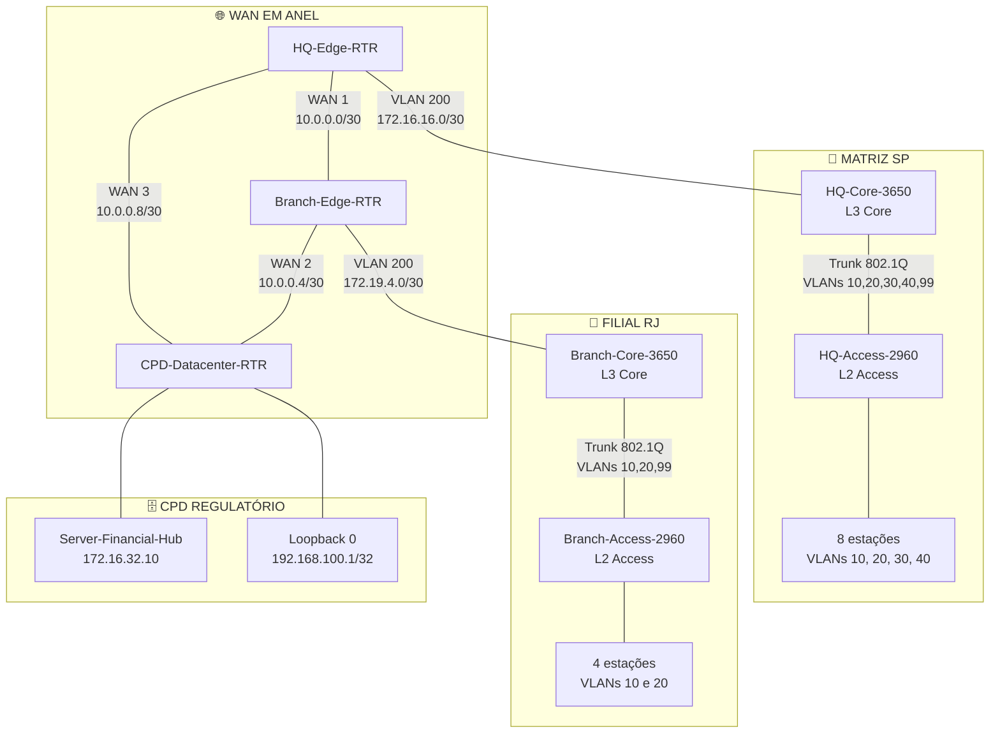
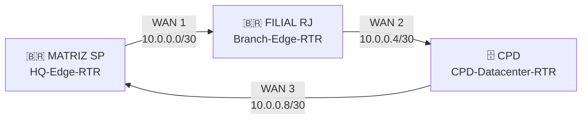

# 🏗️ Arquitetura e Plano de Endereçamento

> **PROJETO ANIBIA — Infraestrutura de Redes Corporativa Simulada**
>
> Documentação da arquitetura física e lógica, segmentação de rede, plano IPv4, Supernetting, VLSM, VLANs, enlaces ponto a ponto e distribuição de endereçamento da infraestrutura simulada no Cisco Packet Tracer.

---

## 📌 Visão Geral

O **PROJETO ANIBIA** representa uma infraestrutura de rede corporativa distribuída em **três localidades estratégicas**:

* 🏢 **Matriz SP (HQ)**
* 🏢 **Filial Regional RJ (Branch)**
* 🗄️ **CPD Regulatório / Datacenter**

As localidades são interconectadas por uma **WAN em topologia de anel**, formada por três enlaces seriais ponto a ponto.

Internamente, a arquitetura combina:

* segmentação lógica por **VLANs**;
* roteamento de Camada 3 nos switches Core;
* enlaces **trunk 802.1Q** entre Core e Access;
* sub-redes departamentais dimensionadas com **VLSM**;
* blocos agregados por **Supernetting**;
* enlaces ponto a ponto utilizando **/30**;
* VLAN dedicada para gerenciamento;
* VLAN dedicada ao trânsito L3 entre Core e roteador;
* DHCP centralizado nos switches Core das localidades;
* conectividade com o CPD através da malha WAN.

A arquitetura foi construída para representar uma rede corporativa segmentada, distribuída e preparada para continuidade de comunicação entre os três sítios.

---

## 🗺️ Arquitetura Física

A infraestrutura possui sete dispositivos de rede gerenciáveis e um servidor central.

### Distribuição dos equipamentos

| Localidade         | Dispositivo            | Modelo             | Função principal           |
| ------------------ | ---------------------- | ------------------ | -------------------------- |
| 🇧🇷 **Matriz SP** | `HQ-Edge-RTR`          | Cisco 2911         | Roteador de borda / ASBR   |
| 🇧🇷 **Matriz SP** | `HQ-Core-3650`         | Catalyst 3650-24PS | Core L3, SVIs, DHCP e OSPF |
| 🇧🇷 **Matriz SP** | `HQ-Access-2960`       | Catalyst 2960-24TT | Acesso L2                  |
| 🇧🇷 **Filial RJ** | `Branch-Edge-RTR`      | Cisco 2911         | Roteador de borda regional |
| 🇧🇷 **Filial RJ** | `Branch-Core-3650`     | Catalyst 3650-24PS | Core L3, SVIs, DHCP e OSPF |
| 🇧🇷 **Filial RJ** | `Branch-Access-2960`   | Catalyst 2960-24TT | Acesso L2                  |
| 🗄️ **CPD**        | `CPD-Datacenter-RTR`   | Cisco 2911         | Roteador do Datacenter     |
| 🗄️ **CPD**        | `Server-Financial-Hub` | Cisco Server PT    | Servidor central           |

---

## 🧩 Organização Hierárquica

A arquitetura local segue uma separação clara entre **borda, Core e acesso**.



---

# 🏢 1. Matriz SP — HQ

A Matriz concentra a maior quantidade de segmentos corporativos da infraestrutura.

Sua arquitetura é formada por:

```text
HQ-Edge-RTR
     │
     │ VLAN 200 / Trânsito L3
     │ 172.16.16.0/30
     │
HQ-Core-3650
     │
     │ Trunk 802.1Q
     │ VLANs 10,20,30,40,99
     │
HQ-Access-2960
     │
     ├── VLAN 10 → Segurança Operacional
     ├── VLAN 20 → Núcleo Financeiro
     ├── VLAN 30 → Dados de Mercado / Analytics
     └── VLAN 40 → Auditoria / Compliance
```

### Equipamentos da Matriz

#### `HQ-Edge-RTR`

**Modelo:** Cisco 2911

Responsabilidades arquiteturais:

* roteamento de borda;
* terminação dos enlaces WAN 1 e WAN 3;
* participação no OSPF;
* integração entre OSPF e BGP;
* comunicação com o CPD através da WAN 3.

#### `HQ-Core-3650`

**Modelo:** Cisco Catalyst 3650-24PS

Responsabilidades:

* roteamento L3;
* criação das SVIs;
* gateway das VLANs corporativas;
* DHCP das VLANs da Matriz;
* conexão L3 com o roteador de borda;
* participação no OSPF.

#### `HQ-Access-2960`

**Modelo:** Cisco Catalyst 2960-24TT

Responsabilidades:

* comutação de Camada 2;
* conexão das estações;
* associação das portas às VLANs;
* uplink trunk para o Core;
* gerenciamento através da VLAN 99.

---

# 🏢 2. Filial Regional RJ

A Filial RJ possui uma estrutura semelhante à Matriz, porém com menor quantidade de segmentos.

```text
Branch-Edge-RTR
       │
       │ VLAN 200 / Trânsito L3
       │ 172.19.4.0/30
       │
Branch-Core-3650
       │
       │ Trunk 802.1Q
       │ VLANs 10,20,99
       │
Branch-Access-2960
       │
       ├── VLAN 10 → Supervisão Regional
       └── VLAN 20 → Operações Regionais
```

### Equipamentos da Filial

#### `Branch-Edge-RTR`

**Modelo:** Cisco 2911

Responsabilidades:

* conexão da filial à WAN;
* terminação da WAN 1;
* terminação da WAN 2;
* conexão L3 com o Core RJ;
* utilização de rotas estáticas de contingência.

#### `Branch-Core-3650`

**Modelo:** Cisco Catalyst 3650-24PS

Responsabilidades:

* roteamento L3;
* SVIs das VLANs regionais;
* DHCP;
* participação no OSPF;
* rota padrão para o roteador de borda.

#### `Branch-Access-2960`

**Modelo:** Cisco Catalyst 2960-24TT

Responsabilidades:

* comutação L2;
* conexão das estações regionais;
* segmentação por VLAN;
* trunk para o Core;
* gerenciamento pela VLAN 99.

---

# 🗄️ 3. CPD Regulatório

O CPD representa o Datacenter Regulatório da infraestrutura.

O ambiente possui:

```text
                    ┌──────────────────────────┐
                    │ CPD-Datacenter-RTR       │
                    │ Cisco 2911               │
                    └────────────┬─────────────┘
                                 │
                    ┌────────────┴─────────────┐
                    │                          │
             LAN CPD /22                 Loopback 0
             172.16.32.0/22             192.168.100.1/32
                    │
                    │
          Server-Financial-Hub
             172.16.32.10
```

### `CPD-Datacenter-RTR`

**Modelo:** Cisco 2911

O roteador:

* termina a WAN 2;
* termina a WAN 3;
* participa da conectividade com a Matriz;
* participa da conectividade com a Filial;
* realiza o peering externo com a Matriz;
* conecta a LAN dos servidores.

### `Server-Financial-Hub`

**Endereço:** `172.16.32.10`

O servidor hospeda os serviços centrais descritos no cenário, incluindo:

* serviços de liquidação;
* banco de dados regulatório;
* índices de mercado;
* serviço DNS corporativo utilizado pelos escopos DHCP.

---

# 📐 4. Estratégia de Endereçamento IPv4

O plano de endereçamento utiliza principalmente blocos privados da RFC 1918.

Os principais blocos utilizados são:

| Finalidade      | Bloco              |
| --------------- | ------------------ |
| Matriz SP       | `172.16.0.0/20`    |
| Filial RJ       | `172.19.0.0/22`    |
| LAN do CPD      | `172.16.32.0/22`   |
| Loopback do CPD | `192.168.100.1/32` |
| WAN 1           | `10.0.0.0/30`      |
| WAN 2           | `10.0.0.4/30`      |
| WAN 3           | `10.0.0.8/30`      |

A arquitetura combina:

* **Supernetting** para organização dos blocos maiores;
* **Subnetting** para divisão em segmentos;
* **VLSM** para utilização de diferentes tamanhos de prefixos;
* **/30** para enlaces ponto a ponto;
* **/32** para a Loopback do CPD.

---

# 🧮 5. Supernet da Matriz — `172.16.0.0/20`

O bloco da Matriz é:

```text
Rede:       172.16.0.0/20
Máscara:    255.255.240.0
Primeiro:   172.16.0.0
Último:     172.16.15.255
```

O bloco possui **4.096 endereços IPv4**.

Ele foi subdividido em quatro redes `/22`.

```text
172.16.0.0/20
│
├── 172.16.0.0/22   → VLAN 10
├── 172.16.4.0/22   → VLAN 20
├── 172.16.8.0/22   → VLAN 30
└── 172.16.12.0/22  → VLAN 40
```

Além desses segmentos corporativos, existem redes específicas para:

* gerenciamento;
* trânsito L3;
* infraestrutura.

---

# 🧱 6. VLANs da Matriz

## VLAN 10 — Segurança Operacional

| Parâmetro | Valor                           |
| --------- | ------------------------------- |
| VLAN      | `10`                            |
| Segmento  | Segurança Operacional (SOC/NOC) |
| Rede      | `172.16.0.0/22`                 |
| Máscara   | `255.255.252.0`                 |
| Gateway   | `172.16.0.1`                    |
| Pool DHCP | `172.16.0.51` → `172.16.3.254`  |
| Broadcast | `172.16.3.255`                  |

A VLAN 10 representa o segmento de **Segurança Operacional / SOC-NOC**.

---

## VLAN 20 — Núcleo Financeiro

| Parâmetro | Valor                          |
| --------- | ------------------------------ |
| VLAN      | `20`                           |
| Segmento  | Núcleo Financeiro e Liquidação |
| Rede      | `172.16.4.0/22`                |
| Máscara   | `255.255.252.0`                |
| Gateway   | `172.16.4.1`                   |
| Pool DHCP | `172.16.4.51` → `172.16.7.254` |
| Broadcast | `172.16.7.255`                 |

A VLAN 20 representa o segmento de **Núcleo Financeiro e Liquidação**.

---

## VLAN 30 — Dados de Mercado e Analytics

| Parâmetro | Valor                           |
| --------- | ------------------------------- |
| VLAN      | `30`                            |
| Segmento  | Dados de Mercado e Analytics    |
| Rede      | `172.16.8.0/22`                 |
| Máscara   | `255.255.252.0`                 |
| Gateway   | `172.16.8.1`                    |
| Pool DHCP | `172.16.8.51` → `172.16.11.254` |
| Broadcast | `172.16.11.255`                 |

A VLAN 30 representa o segmento de **Dados de Mercado e Analytics**.

---

## VLAN 40 — Auditoria e Compliance

| Parâmetro | Valor                            |
| --------- | -------------------------------- |
| VLAN      | `40`                             |
| Segmento  | Auditoria e Compliance Normativo |
| Rede      | `172.16.12.0/22`                 |
| Máscara   | `255.255.252.0`                  |
| Gateway   | `172.16.12.1`                    |
| Pool DHCP | `172.16.12.51` → `172.16.15.254` |
| Broadcast | `172.16.15.255`                  |

A VLAN 40 representa o segmento de **Auditoria e Compliance Normativo**.

---

# 🔐 7. VLAN 99 — Gerência Out-of-Band

A VLAN 99 é utilizada para gerenciamento dos switches de acesso.

### Matriz

| Parâmetro              | Valor                |
| ---------------------- | -------------------- |
| VLAN                   | `99`                 |
| Finalidade             | Gerência Out-of-Band |
| Rede                   | `172.16.99.0/24`     |
| Máscara                | `255.255.255.0`      |
| Gateway                | `172.16.99.1`        |
| IP do switch de acesso | `172.16.99.2`        |
| Broadcast              | `172.16.99.255`      |

O endereço `172.16.99.2` é utilizado como IP fixo do `HQ-Access-2960`.

A VLAN 99 é transportada pelo trunk entre Core e Access.

---

# 🔗 8. VLAN 200 — Trânsito L3 da Matriz

A VLAN 200 é utilizada exclusivamente como rede de trânsito entre o Core e o roteador de borda.

| Parâmetro    | Valor                     |
| ------------ | ------------------------- |
| VLAN         | `200`                     |
| Finalidade   | Trânsito L3 Core ↔ Router |
| Rede         | `172.16.16.0/30`          |
| Máscara      | `255.255.255.252`         |
| HQ-Core-3650 | `172.16.16.1`             |
| HQ-Edge-RTR  | `172.16.16.2`             |
| Broadcast    | `172.16.16.3`             |

Essa rede não representa um segmento destinado às estações de trabalho.

---

# 🧮 9. Supernet da Filial RJ — `172.19.0.0/22`

O bloco regional utilizado pela Filial é:

```text
Rede:       172.19.0.0/22
Máscara:    255.255.252.0
Primeiro:   172.19.0.0
Último:     172.19.3.255
```

O bloco possui **1.024 endereços IPv4**.

Sua divisão principal é:

```text
172.19.0.0/22
│
├── 172.19.0.0/23 → VLAN 10
└── 172.19.2.0/23 → VLAN 20
```

---

# 🧱 10. VLANs da Filial RJ

## VLAN 10 — Supervisão Regional

| Parâmetro | Valor                              |
| --------- | ---------------------------------- |
| VLAN      | `10`                               |
| Segmento  | Supervisão Regional e Fiscalização |
| Rede      | `172.19.0.0/23`                    |
| Máscara   | `255.255.254.0`                    |
| Gateway   | `172.19.0.1`                       |
| Pool DHCP | `172.19.0.51` → `172.19.1.254`     |
| Broadcast | `172.19.1.255`                     |

---

## VLAN 20 — Operações Regionais

| Parâmetro | Valor                          |
| --------- | ------------------------------ |
| VLAN      | `20`                           |
| Segmento  | Operações Regionais e Negócios |
| Rede      | `172.19.2.0/23`                |
| Máscara   | `255.255.254.0`                |
| Gateway   | `172.19.2.1`                   |
| Pool DHCP | `172.19.2.51` → `172.19.3.254` |
| Broadcast | `172.19.3.255`                 |

---

# 🔐 11. VLAN 99 — Gerência da Filial

| Parâmetro              | Valor                |
| ---------------------- | -------------------- |
| VLAN                   | `99`                 |
| Finalidade             | Gerência Out-of-Band |
| Rede                   | `172.19.99.0/24`     |
| Máscara                | `255.255.255.0`      |
| Gateway                | `172.19.99.1`        |
| IP do switch de acesso | `172.19.99.2`        |
| Broadcast              | `172.19.99.255`      |

O `Branch-Access-2960` utiliza o endereço:

```text
172.19.99.2/24
```

com gateway:

```text
172.19.99.1
```

---

# 🔗 12. VLAN 200 — Trânsito L3 da Filial

| Parâmetro        | Valor                     |
| ---------------- | ------------------------- |
| VLAN             | `200`                     |
| Finalidade       | Trânsito L3 Core ↔ Router |
| Rede             | `172.19.4.0/30`           |
| Máscara          | `255.255.255.252`         |
| Branch-Core-3650 | `172.19.4.1`              |
| Branch-Edge-RTR  | `172.19.4.2`              |
| Broadcast        | `172.19.4.3`              |

Assim como na Matriz, a VLAN 200 representa uma rede de trânsito entre os equipamentos L3.

---

# 🗄️ 13. Rede do CPD

A LAN do Datacenter utiliza o bloco:

```text
172.16.32.0/22
```

### Endereçamento

| Dispositivo / Função | Endereço        |
| -------------------- | --------------- |
| Gateway do CPD       | `172.16.32.1`   |
| Server-Financial-Hub | `172.16.32.10`  |
| Máscara              | `255.255.252.0` |
| Prefixo              | `/22`           |

O servidor central utiliza:

```text
IP:       172.16.32.10
Gateway:  172.16.32.1
```

O bloco `/22` foi dimensionado acima da necessidade atual do laboratório, permitindo comportar expansão futura de servidores no Datacenter.

---

# 🔄 14. Loopback do CPD

O roteador do CPD possui uma interface lógica:

```text
Loopback 0
192.168.100.1/32
```

| Parâmetro  | Valor                                   |
| ---------- | --------------------------------------- |
| Interface  | `Loopback 0`                            |
| Endereço   | `192.168.100.1`                         |
| Prefixo    | `/32`                                   |
| Máscara    | `255.255.255.255`                       |
| Finalidade | Teste de peering e serviço ininterrupto |

Por ser uma interface lógica, a Loopback não depende de um enlace físico específico para permanecer configurada.

---

# 🌐 15. WAN em Anel

A interconexão entre as três localidades utiliza três enlaces seriais ponto a ponto.



A topologia resultante é:

```text
                 WAN 3
        ┌────────────────────┐
        │                    │
        ▼                    │
      CPD ─────── WAN 2 ─── RJ
        ▲                    │
        │                    │
        └────── WAN 1 ───────┘
                HQ
```

---

# 🔌 16. WAN 1 — Matriz ↔ Filial RJ

| Parâmetro    | Valor             |
| ------------ | ----------------- |
| Rede         | `10.0.0.0/30`     |
| Máscara      | `255.255.255.252` |
| Matriz SP    | `10.0.0.1`        |
| Interface HQ | `Se0/3/0`         |
| Tipo HQ      | DCE               |
| Filial RJ    | `10.0.0.2`        |
| Interface RJ | `Se0/3/1`         |
| Tipo RJ      | DTE               |

O lado DCE da Matriz utiliza:

```text
clock rate 64000
```

---

# 🔌 17. WAN 2 — Filial RJ ↔ CPD

| Parâmetro     | Valor             |
| ------------- | ----------------- |
| Rede          | `10.0.0.4/30`     |
| Máscara       | `255.255.255.252` |
| Filial RJ     | `10.0.0.5`        |
| Interface RJ  | `Se0/3/0`         |
| Tipo RJ       | DCE               |
| CPD           | `10.0.0.6`        |
| Interface CPD | `Se0/3/1`         |
| Tipo CPD      | DTE               |

O lado DCE da Filial utiliza:

```text
clock rate 64000
```

Esse enlace também representa o caminho utilizado na contingência WAN da Filial.

---

# 🔌 18. WAN 3 — CPD ↔ Matriz

| Parâmetro     | Valor             |
| ------------- | ----------------- |
| Rede          | `10.0.0.8/30`     |
| Máscara       | `255.255.255.252` |
| CPD           | `10.0.0.9`        |
| Interface CPD | `Se0/3/0`         |
| Tipo CPD      | DCE               |
| Matriz SP     | `10.0.0.10`       |
| Interface HQ  | `Se0/3/1`         |
| Tipo HQ       | DTE               |

O lado DCE do CPD utiliza:

```text
clock rate 64000
```

---

# 📊 19. Tabela Consolidada de Endereçamento

## Matriz SP

| VLAN | Segmento                     | Rede             | Máscara           | Gateway       | Broadcast       |
| ---: | ---------------------------- | ---------------- | ----------------- | ------------- | --------------- |
|   10 | Segurança Operacional        | `172.16.0.0/22`  | `255.255.252.0`   | `172.16.0.1`  | `172.16.3.255`  |
|   20 | Núcleo Financeiro            | `172.16.4.0/22`  | `255.255.252.0`   | `172.16.4.1`  | `172.16.7.255`  |
|   30 | Dados de Mercado / Analytics | `172.16.8.0/22`  | `255.255.252.0`   | `172.16.8.1`  | `172.16.11.255` |
|   40 | Auditoria / Compliance       | `172.16.12.0/22` | `255.255.252.0`   | `172.16.12.1` | `172.16.15.255` |
|   99 | Gerência                     | `172.16.99.0/24` | `255.255.255.0`   | `172.16.99.1` | `172.16.99.255` |
|  200 | Trânsito L3                  | `172.16.16.0/30` | `255.255.255.252` | —             | `172.16.16.3`   |

---

## Filial RJ

| VLAN | Segmento            | Rede             | Máscara           | Gateway       | Broadcast       |
| ---: | ------------------- | ---------------- | ----------------- | ------------- | --------------- |
|   10 | Supervisão Regional | `172.19.0.0/23`  | `255.255.254.0`   | `172.19.0.1`  | `172.19.1.255`  |
|   20 | Operações Regionais | `172.19.2.0/23`  | `255.255.254.0`   | `172.19.2.1`  | `172.19.3.255`  |
|   99 | Gerência            | `172.19.99.0/24` | `255.255.255.0`   | `172.19.99.1` | `172.19.99.255` |
|  200 | Trânsito L3         | `172.19.4.0/30`  | `255.255.255.252` | —             | `172.19.4.3`    |

---

## CPD e WAN

| Identificador        | Finalidade          | Rede / IP          | Máscara           |
| -------------------- | ------------------- | ------------------ | ----------------- |
| LAN CPD              | Servidores centrais | `172.16.32.0/22`   | `255.255.252.0`   |
| Server-Financial-Hub | Servidor central    | `172.16.32.10`     | `255.255.252.0`   |
| Loopback 0           | Interface lógica    | `192.168.100.1/32` | `255.255.255.255` |
| WAN 1                | HQ ↔ RJ             | `10.0.0.0/30`      | `255.255.255.252` |
| WAN 2                | RJ ↔ CPD            | `10.0.0.4/30`      | `255.255.255.252` |
| WAN 3                | CPD ↔ HQ            | `10.0.0.8/30`      | `255.255.255.252` |

---

# 💻 20. Distribuição das Estações

A infraestrutura contém **12 estações de trabalho** distribuídas entre Matriz e Filial.

## Matriz SP — 8 estações

São utilizadas duas estações em cada uma das quatro VLANs departamentais:

```text
VLAN 10 → 2 PCs
VLAN 20 → 2 PCs
VLAN 30 → 2 PCs
VLAN 40 → 2 PCs

TOTAL → 8 PCs
```

As estações recebem seus parâmetros IPv4 dinamicamente através do DHCP fornecido pelo `HQ-Core-3650`.

---

## Filial RJ — 4 estações

A Filial possui:

```text
VLAN 10 → 2 PCs
VLAN 20 → 2 PCs

TOTAL → 4 PCs
```

Os endereços também são obtidos dinamicamente através do DHCP do `Branch-Core-3650`.

---

# 📦 21. DHCP — Matriz

O `HQ-Core-3650` atua como servidor DHCP para as quatro VLANs departamentais.

Os primeiros 50 endereços de cada sub-rede são excluídos.

### Exclusões

```text
172.16.0.1  → 172.16.0.50
172.16.4.1  → 172.16.4.50
172.16.8.1  → 172.16.8.50
172.16.12.1 → 172.16.12.50
```

### Pools

| Pool             | Rede             | Gateway       | DNS            |
| ---------------- | ---------------- | ------------- | -------------- |
| `POOL_SEC_OPS`   | `172.16.0.0/22`  | `172.16.0.1`  | `172.16.32.10` |
| `POOL_FINANCIAL` | `172.16.4.0/22`  | `172.16.4.1`  | `172.16.32.10` |
| `POOL_ANALYTICS` | `172.16.8.0/22`  | `172.16.8.1`  | `172.16.32.10` |
| `POOL_AUDIT`     | `172.16.12.0/22` | `172.16.12.1` | `172.16.32.10` |

Assim, as estações recebem endereços a partir de `.51`.

---

# 📦 22. DHCP — Filial RJ

O `Branch-Core-3650` fornece DHCP para as duas VLANs departamentais da Filial.

### Exclusões

```text
172.19.0.1 → 172.19.0.50
172.19.2.1 → 172.19.2.50
```

### Pools

| Pool                 | Rede            | Gateway      | DNS            |
| -------------------- | --------------- | ------------ | -------------- |
| `POOL_RJ_SUPERVISAO` | `172.19.0.0/23` | `172.19.0.1` | `172.16.32.10` |
| `POOL_RJ_OPERATIONS` | `172.19.2.0/23` | `172.19.2.1` | `172.16.32.10` |

As estações da Filial recebem seus endereços a partir do `.51`.

---

# 🔀 23. Arquitetura de Switching

A comunicação local utiliza uma separação entre **Camada 2 e Camada 3**.

### Access

Os switches `2960` trabalham como equipamentos de acesso L2.

As portas destinadas às estações são configuradas como:

```text
switchport mode access
```

e associadas às respectivas VLANs.

### Core

Os switches `3650` executam:

```text
ip routing
```

e hospedam as interfaces SVI.

Dessa forma, o Core funciona como gateway L3 para os segmentos locais.

---

# 🔗 24. Trunks 802.1Q

Os enlaces entre Core e Access são configurados como trunks.

### Matriz

O trunk transporta:

```text
VLAN 10
VLAN 20
VLAN 30
VLAN 40
VLAN 99
```

### Filial RJ

O trunk transporta:

```text
VLAN 10
VLAN 20
VLAN 99
```

A VLAN 200 é utilizada no enlace de trânsito entre Core e roteador e não faz parte do conjunto de VLANs departamentais transportadas pelo trunk de usuários.

---

# 🧭 25. Visão Completa do Plano IP

```text
┌──────────────────────────────────────────────────────────────┐
│                    INFRAESTRUTURA ANIBIA                    │
└──────────────────────────────────────────────────────────────┘

                         WAN /30
              ┌────────────────────────┐
              │                        │
       10.0.0.0/30                10.0.0.8/30
              │                        │
              ▼                        ▼
       ┌─────────────┐           ┌─────────────┐
       │  MATRIZ SP  │           │     CPD     │
       │  AS 65001   │           │  AS 65002   │
       └──────┬──────┘           └──────┬──────┘
              │                         │
        VLAN 200                    LAN /22
      172.16.16.0/30             172.16.32.0/22
              │                         │
              │                    172.16.32.10
              │                         │
              │                  Server-Financial-Hub
              │
       ┌──────▼──────┐
       │ HQ-Core-3650│
       └──────┬──────┘
              │
      ┌───────┴────────┐
      │                │
 VLAN 10            VLAN 20
 172.16.0.0/22     172.16.4.0/22
      │                │
 VLAN 30            VLAN 40
 172.16.8.0/22     172.16.12.0/22


              WAN 1
          10.0.0.0/30
              │
              ▼
       ┌─────────────┐
       │ FILIAL RJ   │
       │ AS 65001    │
       └──────┬──────┘
              │
        VLAN 200
      172.19.4.0/30
              │
       ┌──────▼──────────┐
       │ Branch-Core-3650│
       └──────┬──────────┘
              │
       ┌──────┴───────┐
       │              │
    VLAN 10        VLAN 20
 172.19.0.0/23   172.19.2.0/23
```

---

# 📋 26. Inventário Geral de Redes

| Categoria | Identificador      | Prefixo            |
| --------- | ------------------ | ------------------ |
| HQ        | Supernet principal | `172.16.0.0/20`    |
| HQ        | VLAN 10            | `172.16.0.0/22`    |
| HQ        | VLAN 20            | `172.16.4.0/22`    |
| HQ        | VLAN 30            | `172.16.8.0/22`    |
| HQ        | VLAN 40            | `172.16.12.0/22`   |
| HQ        | VLAN 99            | `172.16.99.0/24`   |
| HQ        | VLAN 200           | `172.16.16.0/30`   |
| RJ        | Supernet principal | `172.19.0.0/22`    |
| RJ        | VLAN 10            | `172.19.0.0/23`    |
| RJ        | VLAN 20            | `172.19.2.0/23`    |
| RJ        | VLAN 99            | `172.19.99.0/24`   |
| RJ        | VLAN 200           | `172.19.4.0/30`    |
| CPD       | LAN de servidores  | `172.16.32.0/22`   |
| CPD       | Loopback 0         | `192.168.100.1/32` |
| WAN       | WAN 1              | `10.0.0.0/30`      |
| WAN       | WAN 2              | `10.0.0.4/30`      |
| WAN       | WAN 3              | `10.0.0.8/30`      |

---

# 🧠 27. Resumo Arquitetural

A arquitetura pode ser resumida em quatro níveis:

### 1️⃣ Segmentação local

As estações são separadas por VLANs conforme o segmento corporativo.

```text
Usuário
   ↓
VLAN
   ↓
Access Switch
```

### 2️⃣ Roteamento local

O Core 3650 hospeda as SVIs e realiza o roteamento entre redes locais.

```text
VLAN
   ↓
SVI
   ↓
Core L3
```

### 3️⃣ Conexão com a borda

O Core utiliza a VLAN 200 como rede de trânsito L3 até o roteador.

```text
Core 3650
   │
   │ /30
   │
Edge Router
```

### 4️⃣ Interconexão entre localidades

Os roteadores de borda formam a malha WAN em anel.

```text
HQ ───── RJ
│         │
└── CPD ──┘
```

---

# 📎 28. Relação com os Demais Documentos

Este documento estabelece a **base física, lógica e de endereçamento** sobre a qual os demais documentos do projeto são construídos.

| Documento                       | Relação                                                                              |
| ------------------------------- | ------------------------------------------------------------------------------------ |
| `02-routing-and-resilience.md`  | Utiliza as redes e enlaces documentados aqui para explicar OSPF, eBGP e contingência |
| `03-design-decisions.md`        | Explica o racional das escolhas arquiteturais apresentadas aqui                      |
| `04-limitations-and-lessons.md` | Analisa as limitações e aprendizados derivados desta implementação                   |
| `verification-playbook.md`      | Contém os comandos utilizados para verificar os elementos descritos aqui             |
| `troubleshooting-runbook.md`    | Utiliza esta arquitetura como referência para isolamento de falhas                   |

---

# 🖼️ 29. Diagramas do Projeto

Os diagramas visuais associados à arquitetura estão organizados em:

```text
assets/
└── diagrams/
    ├── 01-physical-topology.png
    ├── 02-logical-topology.png
    └── 03-wan-ring-routing.png
```

### `01-physical-topology.png`

Representação física dos equipamentos, conexões e localidades.

### `02-logical-topology.png`

Representação lógica das VLANs, Core L3, Access L2 e redes internas.

### `03-wan-ring-routing.png`

Representação da malha WAN em anel e dos enlaces `/30` entre os roteadores.

---

# ✅ 30. Checklist de Arquitetura

* [x] Três localidades documentadas
* [x] Matriz SP documentada
* [x] Filial RJ documentada
* [x] CPD Regulatório documentado
* [x] Sete equipamentos de rede identificados
* [x] Servidor central identificado
* [x] Supernet `172.16.0.0/20` documentada
* [x] Supernet `172.19.0.0/22` documentada
* [x] VLANs da Matriz documentadas
* [x] VLANs da Filial documentadas
* [x] VLAN 99 de gerenciamento documentada
* [x] VLAN 200 de trânsito L3 documentada
* [x] LAN do CPD documentada
* [x] Loopback `192.168.100.1/32` documentada
* [x] WAN 1 documentada
* [x] WAN 2 documentada
* [x] WAN 3 documentada
* [x] Endereços DCE/DTE documentados
* [x] Máscaras documentadas
* [x] Gateways documentados
* [x] Broadcasts documentados
* [x] Pools DHCP documentados
* [x] Exclusões DHCP documentadas
* [x] DNS `172.16.32.10` documentado
* [x] Distribuição das estações documentada
* [x] Trunks 802.1Q documentados
* [x] Arquitetura Core/Access documentada
* [x] Relação entre arquitetura e demais documentos registrada

---

> **Fonte técnica:** cenário oficial do PROJETO ANIBIA e sua implementação documentada no Cisco Packet Tracer.
>
> Este documento descreve a arquitetura e o plano de endereçamento da implementação. Protocolos de roteamento, mecanismos de resiliência, decisões de projeto, limitações e procedimentos operacionais são detalhados nos documentos correspondentes do repositório.
