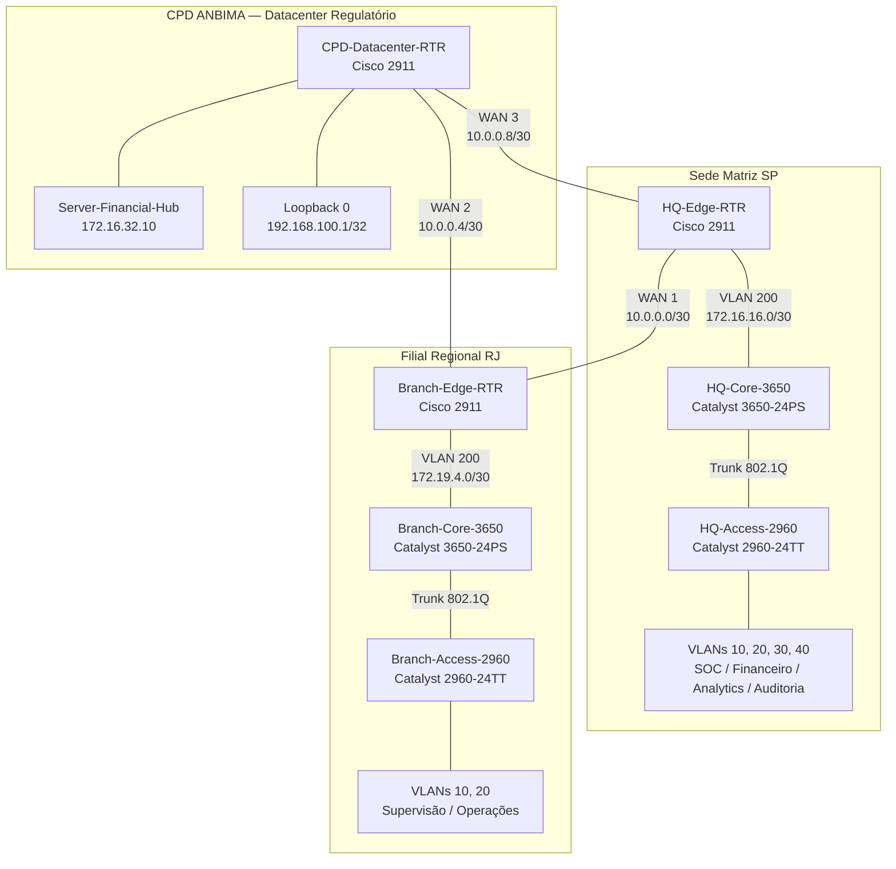

# Architecture and Addressing — ANBIMA Financial Hub

[](#-2-topologia-da-infraestrutura)
[](#-5-plano-de-endere%C3%A7amento-ipv4)
[](#-4-segmenta%C3%A7%C3%A3o-l%C3%B3gica)
[](#-6-endere%C3%A7amento-da-malha-wan)

Documentação da arquitetura física, lógica e do plano de endereçamento IPv4 da infraestrutura corporativa simulada da ANBIMA. O projeto é composto por três sítios estratégicos — **Matriz SP**, **Filial Regional RJ** e **CPD Regulatório/Datacenter de Contingência** — interconectados por enlaces WAN seriais ponto a ponto e estruturados internamente através de comutação multicamada, segmentação por VLANs e sub-redes hierarquizadas.

Este documento concentra exclusivamente a **estrutura da infraestrutura e seu endereçamento**, servindo como referência para identificar onde cada ativo está localizado, qual função exerce e qual rede pertence a cada segmento.

---

## 🏛️ 1. Visão Arquitetural

A infraestrutura está organizada em três ambientes:

| Localidade    | Identificação          | Característica                                                 |
| :------------ | :--------------------- | :------------------------------------------------------------- |
| **Matriz SP** | Sede principal         | Core L3, Access L2, segmentação departamental e DHCP           |
| **Filial RJ** | Unidade regional       | Core L3, Access L2, segmentação regional e DHCP                |
| **CPD**       | Datacenter Regulatório | Servidores centrais, serviços corporativos e conectividade WAN |

A arquitetura utiliza uma separação clara entre:

```text
Camada de Acesso
        │
        ▼
Camada Core / L3
        │
        ▼
Borda do Site
        │
        ▼
Malha WAN
        │
        ▼
Demais Sites
```

A comunicação interna de cada localidade é estruturada através de enlaces Ethernet e VLANs, enquanto a interconexão entre localidades utiliza enlaces seriais ponto a ponto.

---

# 🗺️ 2. Topologia da Infraestrutura

A topologia lógica implementada no projeto é composta pelos três sítios e seus respectivos ativos de infraestrutura.



### Representação física

A implementação física da topologia foi realizada no **Cisco Packet Tracer**, utilizando os equipamentos definidos no cenário.

```text
                         ┌──────────────────────┐
                         │        CPD           │
                         │ Datacenter Regulatório│
                         │                      │
                         │ CPD-Datacenter-RTR   │
                         │ Server-Financial-Hub  │
                         └──────────┬───────────┘
                                    │
                         WAN 2 / WAN 3
                                    │
               ┌────────────────────┴────────────────────┐
               │                                         │
        ┌──────▼───────┐                         ┌──────▼───────┐
        │  MATRIZ SP   │                         │  FILIAL RJ   │
        │              │                         │              │
        │ HQ-Edge-RTR  │─────── WAN 1 ─────────│Branch-Edge-RTR│
        └──────┬───────┘                         └──────┬───────┘
               │                                        │
           VLAN 200                                  VLAN 200
               │                                        │
        ┌──────▼───────┐                         ┌──────▼───────┐
        │HQ-Core-3650  │                         │Branch-Core   │
        │     L3       │                         │     L3       │
        └──────┬───────┘                         └──────┬───────┘
               │                                        │
             Trunk                                    Trunk
               │                                        │
        ┌──────▼───────┐                         ┌──────▼───────┐
        │HQ-Access-2960│                         │Branch-Access │
        │     L2       │                         │     L2       │
        └──────────────┘                         └──────────────┘
```


---

# ⚙️ 3. Especificação dos Ativos

A infraestrutura utiliza os seguintes ativos de rede e servidores.

| Localidade     | Dispositivo            | Modelo                   | Papel na Arquitetura                                                 |
| :------------- | :--------------------- | :----------------------- | :------------------------------------------------------------------- |
| **Matriz SP**  | `HQ-Edge-RTR`          | Cisco 2911               | Roteador de borda da Matriz                                          |
| **Matriz SP**  | `HQ-Core-3650`         | Cisco Catalyst 3650-24PS | Core L3 da Matriz                                                    |
| **Matriz SP**  | `HQ-Access-2960`       | Cisco Catalyst 2960-24TT | Acesso L2 da Matriz                                                  |
| **Filial RJ**  | `Branch-Edge-RTR`      | Cisco 2911               | Roteador de borda regional                                           |
| **Filial RJ**  | `Branch-Core-3650`     | Cisco Catalyst 3650-24PS | Core L3 regional                                                     |
| **Filial RJ**  | `Branch-Access-2960`   | Cisco Catalyst 2960-24TT | Acesso L2 regional                                                   |
| **Datacenter** | `CPD-Datacenter-RTR`   | Cisco 2911               | Roteador de borda do CPD                                             |
| **Datacenter** | `Server-Financial-Hub` | Cisco Server PT          | Servidor de liquidação, banco de dados regulatório e DNS corporativo |

### Distribuição funcional

```text
MATRIZ SP
├── HQ-Edge-RTR
│   └── Borda / WAN
├── HQ-Core-3650
│   └── Core L3 / SVIs / DHCP
└── HQ-Access-2960
    └── Acesso L2 / VLANs

FILIAL RJ
├── Branch-Edge-RTR
│   └── Borda / WAN
├── Branch-Core-3650
│   └── Core L3 / SVIs / DHCP
└── Branch-Access-2960
    └── Acesso L2 / VLANs

CPD
├── CPD-Datacenter-RTR
│   └── Borda / WAN / LAN CPD
└── Server-Financial-Hub
    └── Serviços centrais
```

---

# 🧩 4. Segmentação Lógica

A segmentação interna da infraestrutura é realizada através de VLANs.

A **Matriz SP** possui quatro VLANs departamentais, uma VLAN dedicada ao gerenciamento Out-of-Band e uma VLAN específica para trânsito L3.

A **Filial RJ** possui duas VLANs departamentais, uma VLAN de gerenciamento e uma VLAN específica para trânsito L3.

## 4.1 Matriz SP

| VLAN  | Segmento Corporativo               | Sub-rede         | Máscara           | Gateway SVI   |
| :---- | :--------------------------------- | :--------------- | :---------------- | :------------ |
| `10`  | Segurança Operacional (SOC/NOC)    | `172.16.0.0/22`  | `255.255.252.0`   | `172.16.0.1`  |
| `20`  | Núcleo Financeiro e Liquidação     | `172.16.4.0/22`  | `255.255.252.0`   | `172.16.4.1`  |
| `30`  | Dados de Mercado e Analytics       | `172.16.8.0/22`  | `255.255.252.0`   | `172.16.8.1`  |
| `40`  | Auditoria e Compliance Normativo   | `172.16.12.0/22` | `255.255.252.0`   | `172.16.12.1` |
| `99`  | Gerência Out-of-Band (Switches)    | `172.16.99.0/24` | `255.255.255.0`   | `172.16.99.1` |
| `200` | Enlace Trânsito L3 (Core ↔ Router) | `172.16.16.0/30` | `255.255.255.252` | `172.16.16.1` |

### Uplink da Matriz

```text
HQ-Core-3650
Gig1/0/1
      │
      │ Trunk 802.1Q
      │ VLANs 10,20,30,40,99
      ▼
HQ-Access-2960
Gig0/1
```

A VLAN `200` é utilizada especificamente no enlace de trânsito L3 entre o Core e o roteador.

---

## 4.2 Filial Regional RJ

| VLAN  | Segmento Corporativo                  | Sub-rede         | Máscara           | Gateway SVI   |
| :---- | :------------------------------------ | :--------------- | :---------------- | :------------ |
| `10`  | Supervisão Regional e Fiscalização    | `172.19.0.0/23`  | `255.255.254.0`   | `172.19.0.1`  |
| `20`  | Operações Regionais e Negócios        | `172.19.2.0/23`  | `255.255.254.0`   | `172.19.2.1`  |
| `99`  | Gerência Out-of-Band (Switches RJ)    | `172.19.99.0/24` | `255.255.255.0`   | `172.19.99.1` |
| `200` | Enlace Trânsito L3 (Core RJ ↔ Router) | `172.19.4.0/30`  | `255.255.255.252` | `172.19.4.1`  |

### Uplink da Filial

```text
Branch-Core-3650
Gig1/0/1
      │
      │ Trunk 802.1Q
      │ VLANs 10,20,99
      ▼
Branch-Access-2960
Gig0/1
```

A VLAN `200` é utilizada especificamente no enlace de trânsito L3 entre o Core RJ e o roteador regional.

---

# 📐 5. Plano de Endereçamento IPv4

O plano de endereçamento utiliza blocos privados definidos no espaço RFC 1918 e emprega diferentes tamanhos de prefixo conforme a função de cada segmento.

A arquitetura utiliza:

```text
/20  → bloco agregado da Matriz
/22  → segmentos departamentais da Matriz
/23  → segmentos departamentais da Filial
/24  → gerenciamento
/30  → enlaces ponto a ponto
/32  → Loopback
```

---

## 5.1 Bloco Agregado — Matriz SP

O bloco:

```text
172.16.0.0/20
```

possui:

```text
Máscara:
255.255.240.0

Endereço inicial:
172.16.0.0

Endereço final:
172.16.15.255

Total:
4096 endereços
```

O bloco foi dividido em sub-redes departamentais `/22`, utilizando salto de 4 em 4 no terceiro octeto.

Cada `/22` fornece:

```text
1024 endereços totais
1022 hosts úteis
```

### Distribuição

| VLAN | Rede             | Faixa de hosts                     | Broadcast       |
| :--- | :--------------- | :--------------------------------- | :-------------- |
| `10` | `172.16.0.0/22`  | `172.16.0.51` até `172.16.3.254`   | `172.16.3.255`  |
| `20` | `172.16.4.0/22`  | `172.16.4.51` até `172.16.7.254`   | `172.16.7.255`  |
| `30` | `172.16.8.0/22`  | `172.16.8.51` até `172.16.11.254`  | `172.16.11.255` |
| `40` | `172.16.12.0/22` | `172.16.12.51` até `172.16.15.254` | `172.16.15.255` |

Os primeiros 50 endereços úteis de cada sub-rede são reservados, fazendo com que a distribuição DHCP seja iniciada em `.51`.

---

## 5.2 Gerenciamento — Matriz SP

```text
VLAN 99
172.16.99.0/24
```

| Elemento       | Endereço        |
| :------------- | :-------------- |
| Rede           | `172.16.99.0`   |
| Máscara        | `255.255.255.0` |
| Gateway        | `172.16.99.1`   |
| HQ-Access-2960 | `172.16.99.2`   |
| Broadcast      | `172.16.99.255` |

---

## 5.3 Trânsito L3 — Matriz SP

```text
VLAN 200
172.16.16.0/30
```

| Elemento           | Endereço          |
| :----------------- | :---------------- |
| Rede               | `172.16.16.0`     |
| Máscara            | `255.255.255.252` |
| Core               | `172.16.16.1`     |
| Roteador           | `172.16.16.2`     |
| Endereço adicional | `172.16.16.3`     |
| Broadcast          | `172.16.16.3`     |

---

# 🏢 6. Endereçamento da Filial Regional RJ

O bloco regional utilizado pela Filial é:

```text
172.19.0.0/22
```

com:

```text
Máscara:
255.255.252.0

Endereço inicial:
172.19.0.0

Endereço final:
172.19.3.255

Total:
1024 endereços
```

O bloco foi dividido em sub-redes `/23`, utilizando salto de 2 em 2 no terceiro octeto.

Cada `/23` fornece:

```text
512 endereços totais
510 hosts úteis
```

### Distribuição

| VLAN | Rede            | Faixa de hosts                   | Broadcast      |
| :--- | :-------------- | :------------------------------- | :------------- |
| `10` | `172.19.0.0/23` | `172.19.0.51` até `172.19.1.254` | `172.19.1.255` |
| `20` | `172.19.2.0/23` | `172.19.2.51` até `172.19.3.254` | `172.19.3.255` |

---

## 6.1 Gerenciamento — Filial RJ

```text
VLAN 99
172.19.99.0/24
```

| Elemento           | Endereço        |
| :----------------- | :-------------- |
| Rede               | `172.19.99.0`   |
| Máscara            | `255.255.255.0` |
| Gateway            | `172.19.99.1`   |
| Branch-Access-2960 | `172.19.99.2`   |
| Broadcast          | `172.19.99.255` |

---

## 6.2 Trânsito L3 — Filial RJ

```text
VLAN 200
172.19.4.0/30
```

| Elemento  | Endereço          |
| :-------- | :---------------- |
| Rede      | `172.19.4.0`      |
| Máscara   | `255.255.255.252` |
| Core      | `172.19.4.1`      |
| Roteador  | `172.19.4.2`      |
| Broadcast | `172.19.4.3`      |

---

# 🗄️ 7. Endereçamento do CPD Regulatório

O Datacenter possui uma rede dedicada para os servidores centrais.

```text
172.16.32.0/22
```

A rede foi dimensionada acima da necessidade atual de um único servidor para comportar expansão futura de servidores redundantes no Datacenter de Contingência.

| Elemento             | Endereço         |
| :------------------- | :--------------- |
| Rede CPD             | `172.16.32.0/22` |
| Máscara              | `255.255.252.0`  |
| Gateway              | `172.16.32.1`    |
| Server-Financial-Hub | `172.16.32.10`   |

### Server-Financial-Hub

O servidor central possui o endereço:

```text
172.16.32.10
```

e representa o servidor de:

* liquidação;
* banco de dados regulatório;
* DNS corporativo.

---

## 7.1 Loopback 0

O roteador do CPD possui a Loopback 0:

```text
192.168.100.1/32
```

| Elemento   | Endereço                                |
| :--------- | :-------------------------------------- |
| Interface  | `Loopback 0`                            |
| Prefixo    | `/32`                                   |
| Endereço   | `192.168.100.1`                         |
| Finalidade | Teste de Peering e Serviço Ininterrupto |

---

# 🌐 8. Endereçamento da Malha WAN

Os enlaces entre os três sítios utilizam sub-redes `/30`, adequadas aos enlaces ponto a ponto definidos na arquitetura.

Cada `/30` possui:

```text
4 endereços totais
2 endereços utilizáveis
```

A malha é composta por três enlaces.

---

## 8.1 WAN 1 — Matriz SP ↔ Filial RJ

```text
10.0.0.0/30
255.255.255.252
```

| Ponta | Equipamento       | Interface | Endereço   | Papel |
| :---- | :---------------- | :-------- | :--------- | :---- |
| A     | `HQ-Edge-RTR`     | `Se0/3/0` | `10.0.0.1` | DCE   |
| B     | `Branch-Edge-RTR` | `Se0/3/1` | `10.0.0.2` | DTE   |

```text
10.0.0.0  → Rede
10.0.0.1  → HQ
10.0.0.2  → RJ
10.0.0.3  → Broadcast
```

---

## 8.2 WAN 2 — Filial RJ ↔ CPD

```text
10.0.0.4/30
255.255.255.252
```

| Ponta | Equipamento          | Interface | Endereço   | Papel |
| :---- | :------------------- | :-------- | :--------- | :---- |
| A     | `Branch-Edge-RTR`    | `Se0/3/0` | `10.0.0.5` | DCE   |
| B     | `CPD-Datacenter-RTR` | `Se0/3/1` | `10.0.0.6` | DTE   |

```text
10.0.0.4  → Rede
10.0.0.5  → RJ
10.0.0.6  → CPD
10.0.0.7  → Broadcast
```

---

## 8.3 WAN 3 — CPD ↔ Matriz SP

```text
10.0.0.8/30
255.255.255.252
```

| Ponta | Equipamento          | Interface | Endereço    | Papel |
| :---- | :------------------- | :-------- | :---------- | :---- |
| A     | `CPD-Datacenter-RTR` | `Se0/3/0` | `10.0.0.9`  | DCE   |
| B     | `HQ-Edge-RTR`        | `Se0/3/1` | `10.0.0.10` | DTE   |

```text
10.0.0.8  → Rede
10.0.0.9  → CPD
10.0.0.10 → HQ
10.0.0.11 → Broadcast
```

---

# 🔌 9. Interfaces Seriais e Distribuição DCE/DTE

Os roteadores utilizam módulo `HWIC-2T` no **Slot 3** para os enlaces seriais.

A distribuição física das interfaces é:

| Equipamento          | Interface | Enlace | Papel |
| :------------------- | :-------- | :----- | :---- |
| `HQ-Edge-RTR`        | `Se0/3/0` | WAN 1  | DCE   |
| `HQ-Edge-RTR`        | `Se0/3/1` | WAN 3  | DTE   |
| `Branch-Edge-RTR`    | `Se0/3/0` | WAN 2  | DCE   |
| `Branch-Edge-RTR`    | `Se0/3/1` | WAN 1  | DTE   |
| `CPD-Datacenter-RTR` | `Se0/3/0` | WAN 3  | DCE   |
| `CPD-Datacenter-RTR` | `Se0/3/1` | WAN 2  | DTE   |

As interfaces DCE utilizam:

```cisco
clock rate 64000
```

---

# 📊 10. Tabela Geral de Endereçamento

| Local  | Segmento   | Prefixo            | Gateway / Ponta | Endereço associado |
| :----- | :--------- | :----------------- | :-------------- | :----------------- |
| Matriz | VLAN 10    | `172.16.0.0/22`    | `172.16.0.1`    | Core SP            |
| Matriz | VLAN 20    | `172.16.4.0/22`    | `172.16.4.1`    | Core SP            |
| Matriz | VLAN 30    | `172.16.8.0/22`    | `172.16.8.1`    | Core SP            |
| Matriz | VLAN 40    | `172.16.12.0/22`   | `172.16.12.1`   | Core SP            |
| Matriz | VLAN 99    | `172.16.99.0/24`   | `172.16.99.1`   | Gerência           |
| Matriz | VLAN 200   | `172.16.16.0/30`   | `172.16.16.1`   | Core SP            |
| Filial | VLAN 10    | `172.19.0.0/23`    | `172.19.0.1`    | Core RJ            |
| Filial | VLAN 20    | `172.19.2.0/23`    | `172.19.2.1`    | Core RJ            |
| Filial | VLAN 99    | `172.19.99.0/24`   | `172.19.99.1`   | Gerência           |
| Filial | VLAN 200   | `172.19.4.0/30`    | `172.19.4.1`    | Core RJ            |
| CPD    | LAN        | `172.16.32.0/22`   | `172.16.32.1`   | CPD Router         |
| CPD    | Loopback 0 | `192.168.100.1/32` | —               | CPD Router         |
| WAN 1  | HQ ↔ RJ    | `10.0.0.0/30`      | `.1 / .2`       | Serial             |
| WAN 2  | RJ ↔ CPD   | `10.0.0.4/30`      | `.5 / .6`       | Serial             |
| WAN 3  | CPD ↔ HQ   | `10.0.0.8/30`      | `.9 / .10`      | Serial             |

---

# 🧱 11. Hierarquia de Endereçamento

A organização dos prefixos pode ser visualizada da seguinte maneira:

```text
IPv4
│
├── Matriz SP
│   └── 172.16.0.0/20
│       ├── 172.16.0.0/22   → VLAN 10
│       ├── 172.16.4.0/22   → VLAN 20
│       ├── 172.16.8.0/22   → VLAN 30
│       └── 172.16.12.0/22  → VLAN 40
│
├── Gerenciamento SP
│   └── 172.16.99.0/24      → VLAN 99
│
├── Trânsito SP
│   └── 172.16.16.0/30      → VLAN 200
│
├── Filial RJ
│   └── 172.19.0.0/22
│       ├── 172.19.0.0/23   → VLAN 10
│       └── 172.19.2.0/23   → VLAN 20
│
├── Gerenciamento RJ
│   └── 172.19.99.0/24      → VLAN 99
│
├── Trânsito RJ
│   └── 172.19.4.0/30       → VLAN 200
│
├── CPD
│   └── 172.16.32.0/22      → Servidores
│
├── Loopback
│   └── 192.168.100.1/32
│
└── WAN
    ├── 10.0.0.0/30         → WAN 1
    ├── 10.0.0.4/30         → WAN 2
    └── 10.0.0.8/30         → WAN 3
```

---

# 🔗 12. Mapa de Conectividade Física e Lógica

| Origem               | Interface   | Meio / Segmento       | Destino                | Interface |
| :------------------- | :---------- | :-------------------- | :--------------------- | :-------- |
| `HQ-Core-3650`       | Trânsito L3 | VLAN 200              | `HQ-Edge-RTR`          | `Gig0/0`  |
| `HQ-Core-3650`       | `Gig1/0/1`  | Trunk 802.1Q          | `HQ-Access-2960`       | `Gig0/1`  |
| `Branch-Core-3650`   | Trânsito L3 | VLAN 200              | `Branch-Edge-RTR`      | `Gig0/0`  |
| `Branch-Core-3650`   | `Gig1/0/1`  | Trunk 802.1Q          | `Branch-Access-2960`   | `Gig0/1`  |
| `HQ-Edge-RTR`        | `Se0/3/0`   | WAN 1                 | `Branch-Edge-RTR`      | `Se0/3/1` |
| `Branch-Edge-RTR`    | `Se0/3/0`   | WAN 2                 | `CPD-Datacenter-RTR`   | `Se0/3/1` |
| `CPD-Datacenter-RTR` | `Se0/3/0`   | WAN 3                 | `HQ-Edge-RTR`          | `Se0/3/1` |
| `CPD-Datacenter-RTR` | LAN         | Rede `172.16.32.0/22` | `Server-Financial-Hub` | —         |

---

# 📌 13. Resumo da Arquitetura

```text
┌─────────────────────────────────────────────────────────────┐
│                    ANBIMA FINANCIAL HUB                     │
├─────────────────────────────────────────────────────────────┤
│                                                             │
│  MATRIZ SP                 FILIAL RJ              CPD       │
│  ─────────                 ─────────              ───       │
│                                                             │
│  HQ-Edge-RTR               Branch-Edge-RTR        CPD-RTR   │
│       │                         │                    │       │
│  HQ-Core-3650              Branch-Core-3650        │       │
│       │                         │                    │       │
│  HQ-Access-2960            Branch-Access-2960      │       │
│       │                         │                    │       │
│  VLAN 10/20/30/40           VLAN 10/20          Server    │
│  VLAN 99                    VLAN 99              Hub       │
│  VLAN 200                   VLAN 200                       │
│       │                         │                    │       │
│       └─────────────── WAN ────┴────────────────────┘       │
│                                                             │
└─────────────────────────────────────────────────────────────┘
```

### Inventário de redes

| Categoria               | Quantidade | Prefixos principais |
| :---------------------- | :--------: | :------------------ |
| VLANs departamentais SP |     `4`    | `/22`               |
| VLANs departamentais RJ |     `2`    | `/23`               |
| VLANs de gerenciamento  |     `2`    | `/24`               |
| VLANs de trânsito L3    |     `2`    | `/30`               |
| LAN do CPD              |     `1`    | `/22`               |
| Loopback                |     `1`    | `/32`               |
| Enlaces WAN             |     `3`    | `/30`               |

---

## 📁 14. Referência de Arquivos Relacionados

A arquitetura e o endereçamento documentados aqui servem como base para os demais documentos técnicos do projeto.

```text
docs/
├── 01-architecture-and-addressing.md
├── routing-and-resilience.md
├── design-decisions.md
└── limitations-and-lessons.md
```

A separação de responsabilidades entre esses documentos é intencional:

| Documento                           | Escopo                                                                       |
| :---------------------------------- | :--------------------------------------------------------------------------- |
| `01-architecture-and-addressing.md` | **Onde está cada coisa e qual endereço/rede ela utiliza**                    |
| `routing-and-resilience.md`         | **Como os caminhos são aprendidos, anunciados e utilizados em contingência** |
| `design-decisions.md`               | **Por que determinadas escolhas arquiteturais foram adotadas**               |
| `limitations-and-lessons.md`        | **Limitações observadas, restrições do laboratório e aprendizados**          |

Este arquivo, portanto, funciona como o **mapa estrutural da infraestrutura**: topologia, ativos, segmentação e endereçamento. Os mecanismos de roteamento, resiliência, justificativas de engenharia e limitações são documentados separadamente para evitar duplicação e manter cada documento com uma função técnica clara.
