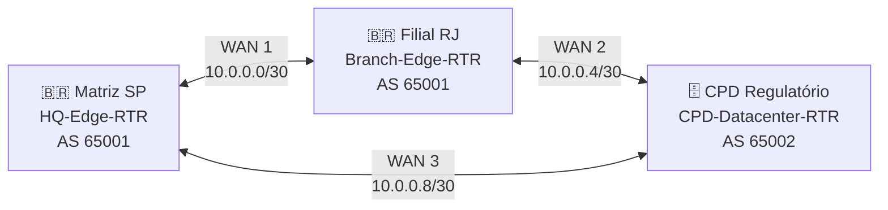
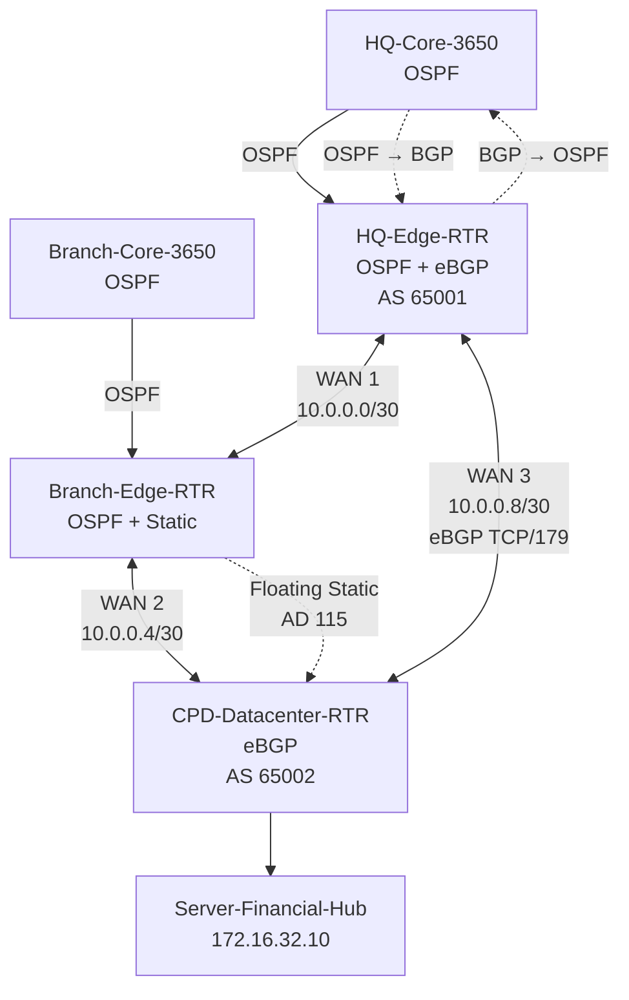

# 🔄 Roteamento e Resiliência

> **PROJETO ANIBIA — Infraestrutura de Redes Corporativa Simulada**
>
> Documentação dos protocolos de roteamento, domínios OSPF e BGP, redistribuição entre protocolos, malha WAN em anel, rotas estáticas flutuantes e mecanismo de contingência da Filial RJ.

---

## 📌 Visão Geral

O PROJETO ANIBIA utiliza uma arquitetura de **roteamento híbrido**, combinando:

* **OSPFv2** como protocolo de roteamento interno;
* **eBGPv4** para a comunicação entre o ambiente corporativo e o CPD;
* **redistribuição OSPF ↔ BGP** no roteador de borda da Matriz;
* **rotas estáticas flutuantes com AD 115** como mecanismo de contingência para a Filial RJ;
* **WAN em topologia de anel**, formada por três enlaces seriais `/30`.

A arquitetura separa o roteamento interno do roteamento entre Sistemas Autônomos, utilizando o `HQ-Edge-RTR` como principal ponto de integração entre os domínios de roteamento.

```text
┌───────────────────────────────────────────────────────────────┐
│                    ROTEAMENTO ANIBIA                          │
├───────────────────────────────────────────────────────────────┤
│                                                               │
│  OSPFv2                  eBGPv4                Contingência   │
│  Área 0                  AS 65001 ↔ AS 65002  AD 115         │
│     │                         │                    │           │
│     └──────────┐    ┌─────────┘                    │           │
│                ▼    ▼                              ▼           │
│             HQ-Edge-RTR                    Branch-Edge-RTR    │
│                │                                            │
│                └────── Redistribuição ──────┐               │
│                                             ▼               │
│                                          WAN em anel        │
│                                                               │
└───────────────────────────────────────────────────────────────┘
```

---

# 🌐 1. Topologia WAN

A infraestrutura WAN é organizada em um **anel fechado de três localidades**:



Os três enlaces são:

| Enlace    | Origem    | Destino   | Rede          |
| --------- | --------- | --------- | ------------- |
| **WAN 1** | Matriz SP | Filial RJ | `10.0.0.0/30` |
| **WAN 2** | Filial RJ | CPD       | `10.0.0.4/30` |
| **WAN 3** | CPD       | Matriz SP | `10.0.0.8/30` |

Essa estrutura fornece dois caminhos físicos possíveis entre a Filial e os demais pontos da infraestrutura.

---

# 🔌 2. Interfaces WAN e Papel DCE/DTE

O projeto utiliza módulos seriais nos roteadores e estabelece uma distribuição específica de interfaces DCE e DTE.

## WAN 1

```text
HQ-Edge-RTR
Se0/3/0 — DCE
10.0.0.1/30
      │
      │ WAN 1
      │
10.0.0.2/30
Se0/3/1 — DTE
Branch-Edge-RTR
```

O lado DCE da Matriz utiliza:

```cisco
clock rate 64000
```

---

## WAN 2

```text
Branch-Edge-RTR
Se0/3/0 — DCE
10.0.0.5/30
      │
      │ WAN 2
      │
10.0.0.6/30
Se0/3/1 — DTE
CPD-Datacenter-RTR
```

O lado DCE da Filial utiliza:

```cisco
clock rate 64000
```

---

## WAN 3

```text
CPD-Datacenter-RTR
Se0/3/0 — DCE
10.0.0.9/30
      │
      │ WAN 3
      │
10.0.0.10/30
Se0/3/1 — DTE
HQ-Edge-RTR
```

O lado DCE do CPD utiliza:

```cisco
clock rate 64000
```

---

# 🧭 3. OSPFv2 — Roteamento Interno

O **OSPFv2** é utilizado como protocolo de roteamento interno da infraestrutura corporativa.

O domínio OSPF utiliza:

```text
Process ID: 1
Área:       0
```

A Área 0 funciona como backbone do domínio OSPF.

O protocolo participa do roteamento entre:

* Core da Matriz;
* Edge da Matriz;
* Core da Filial;
* Edge da Filial;
* enlaces necessários da infraestrutura WAN.

---

## 3.1. Wildcard Masks

O cenário utiliza as seguintes máscaras coringa:

| Prefixo | Máscara           | Wildcard    |
| ------- | ----------------- | ----------- |
| `/22`   | `255.255.252.0`   | `0.0.3.255` |
| `/23`   | `255.255.254.0`   | `0.0.1.255` |
| `/24`   | `255.255.255.0`   | `0.0.0.255` |
| `/30`   | `255.255.255.252` | `0.0.0.3`   |

Essas máscaras são utilizadas nas declarações `network` do OSPF.

---

# 🏢 4. OSPF na Matriz

O `HQ-Core-3650` participa do OSPF com as redes internas da Matriz e o enlace de trânsito L3.

O `HQ-Edge-RTR` também participa do OSPF.

O enlace entre os dois utiliza:

```text
172.16.16.0/30
```

com:

```text
HQ-Core-3650 → 172.16.16.1
HQ-Edge-RTR   → 172.16.16.2
```

O `HQ-Edge-RTR` utiliza o seguinte Router ID:

```text
2.2.2.2
```

---

# 🏢 5. OSPF na Filial RJ

O `Branch-Core-3650` participa do OSPF juntamente com o `Branch-Edge-RTR`.

O enlace de trânsito L3 utiliza:

```text
172.19.4.0/30
```

com:

```text
Branch-Core-3650 → 172.19.4.1
Branch-Edge-RTR  → 172.19.4.2
```

O Router ID do Core RJ é:

```text
4.4.4.4
```

O domínio OSPF da Filial anuncia as redes regionais e o enlace de trânsito.

---

# 📡 6. OSPF e a Malha WAN

A utilização do OSPF permite que os roteadores conheçam os caminhos disponíveis dentro do domínio interno.

Em condições normais, o tráfego da Filial destinado ao CPD utiliza o caminho:

```text
Filial RJ
    │
    │ WAN 1
    ▼
Matriz SP
    │
    │ WAN 3
    ▼
CPD
```

Representação:

```text
PC-RJ
  │
  ▼
Branch-Core
  │
  ▼
Branch-Edge
  │
  │ WAN 1
  ▼
HQ-Edge
  │
  │ WAN 3
  ▼
CPD-Edge
  │
  ▼
Server-Financial-Hub
```

O caminho alternativo é fornecido pela WAN 2:

```text
Filial RJ
    │
    │ WAN 2
    ▼
CPD
```

---

# 🌍 7. eBGPv4

O **eBGPv4** é utilizado para interconectar os dois Sistemas Autônomos definidos no projeto.

| Sistema         |      AS |
| --------------- | ------: |
| Matriz + Filial | `65001` |
| CPD Regulatório | `65002` |

Portanto:

```text
AS 65001
Matriz + Filial
       │
       │ eBGP
       │
AS 65002
CPD Regulatório
```

---

# 🔗 8. Peering eBGP

A sessão eBGP é estabelecida sobre a **WAN 3**.

Os vizinhos são:

| Dispositivo          | IP          |      AS |
| -------------------- | ----------- | ------: |
| `HQ-Edge-RTR`        | `10.0.0.10` | `65001` |
| `CPD-Datacenter-RTR` | `10.0.0.9`  | `65002` |

A sessão utiliza:

```text
TCP/179
```

Configuração conceitual no `HQ-Edge-RTR`:

```cisco
router bgp 65001
 neighbor 10.0.0.9 remote-as 65002
```

No CPD:

```cisco
router bgp 65002
 neighbor 10.0.0.10 remote-as 65001
```

---

# 📢 9. Prefixos Anunciados pelo CPD

O CPD anuncia ao ambiente corporativo os prefixos necessários para alcançar seus recursos.

São anunciados:

```text
172.16.32.0/22
10.0.0.4/30
192.168.100.1/32
```

Eles representam:

* a LAN dos servidores do CPD;
* o enlace WAN 2;
* a Loopback 0 do roteador do CPD.

---

# 🔄 10. Redistribuição BGP → OSPF

O `HQ-Edge-RTR` funciona como ponto de integração entre os dois protocolos.

As rotas aprendidas pelo BGP a partir do CPD são injetadas no OSPF.

A configuração utilizada é:

```cisco
router ospf 1
 redistribute bgp 65001 subnets
exit
```

Isso permite que os dispositivos que participam apenas do OSPF, como o Core da Matriz, conheçam as redes aprendidas através do BGP.

O fluxo pode ser representado como:

```text
CPD
 │
 │ eBGP
 ▼
HQ-Edge-RTR
 │
 │ Redistribute BGP → OSPF
 ▼
OSPF Área 0
 │
 ▼
HQ-Core-3650
```

---

# 🔄 11. Redistribuição OSPF → BGP

O processo inverso também ocorre no `HQ-Edge-RTR`.

As redes corporativas aprendidas através do OSPF são redistribuídas para o BGP:

```cisco
router bgp 65001
 redistribute ospf 1
exit
```

O fluxo torna-se:

```text
VLANs / Redes Corporativas
          │
          ▼
     HQ-Core-3650
          │
        OSPF
          │
          ▼
     HQ-Edge-RTR
          │
  Redistribute OSPF → BGP
          │
          ▼
         eBGP
          │
          ▼
     CPD-Datacenter
```

Dessa maneira, o CPD consegue aprender os prefixos corporativos através do BGP.

---

# 🔁 12. Ponto de Integração do Roteamento

O `HQ-Edge-RTR` possui uma função central na arquitetura de roteamento.

Ele conecta:

```text
                ┌──────────────┐
                │   OSPF       │
                │  Área 0      │
                └──────┬───────┘
                       │
                       │
                ┌──────▼───────┐
                │ HQ-Edge-RTR  │
                │              │
                │ Redistribui  │
                │ OSPF ↔ BGP   │
                └──────┬───────┘
                       │
                       │
                ┌──────▼───────┐
                │    eBGP      │
                │ AS 65001 ↔   │
                │ AS 65002     │
                └──────────────┘
```

O Core não precisa executar BGP diretamente.

O roteador de borda funciona como fronteira entre:

* o domínio interno OSPF;
* o domínio externo BGP.

---

# 🛟 13. Resiliência da Filial RJ

A Filial RJ possui um mecanismo adicional de contingência porque **não executa BGP diretamente**.

O `Branch-Edge-RTR` utiliza **rotas estáticas flutuantes** com:

```text
Administrative Distance = 115
```

O valor é superior à distância administrativa do OSPF:

```text
OSPF = 110
Floating Static = 115
```

Portanto, as rotas estáticas permanecem como caminhos de contingência enquanto as rotas OSPF estiverem disponíveis.

---

# 🧭 14. Rotas Estáticas Flutuantes

No `Branch-Edge-RTR`, são configuradas rotas para os principais blocos remotos.

### Redes corporativas da Matriz

```cisco
ip route 172.16.0.0 255.255.240.0 10.0.0.1 115
```

### Gerência da Matriz

```cisco
ip route 172.16.99.0 255.255.255.0 10.0.0.1 115
```

### LAN do CPD

```cisco
ip route 172.16.32.0 255.255.252.0 10.0.0.6 115
```

### Loopback do CPD

```cisco
ip route 192.168.100.1 255.255.255.255 10.0.0.6 115
```

---

# 🔄 15. Redistribuição das Rotas Estáticas no OSPF

As rotas estáticas de contingência também são redistribuídas para o OSPF da Filial.

No `Branch-Edge-RTR`:

```cisco
router ospf 1
 redistribute static subnets
exit
```

Isso permite que o `Branch-Core-3650` tenha conhecimento dos caminhos de contingência instalados no roteador regional.

O fluxo é:

```text
Floating Static Route
        │
        ▼
Branch-Edge-RTR
        │
        │ redistribute static subnets
        ▼
     OSPF Área 0
        │
        ▼
Branch-Core-3650
```

---

# 🧭 16. Rota Padrão do Core RJ

O `Branch-Core-3650` possui uma rota padrão apontando para o `Branch-Edge-RTR`:

```cisco
ip route 0.0.0.0 0.0.0.0 172.19.4.2
```

Assim, o Core encaminha destinos não conhecidos para o roteador de borda.

```text
Branch-Core-3650
        │
        │ default route
        ▼
172.19.4.2
        │
        ▼
Branch-Edge-RTR
```

---

# 🚨 17. Cenário de Falha WAN

O principal teste de resiliência consiste em interromper o enlace **WAN 1** entre a Filial RJ e a Matriz.

### Situação normal

```text
RJ ───────────────► HQ ───────────────► CPD
       WAN 1                 WAN 3
```

### Falha

A interface:

```text
Branch-Edge-RTR Se0/3/0
```

é colocada em:

```cisco
shutdown
```

Com isso, o caminho direto entre RJ e Matriz é interrompido.

---

# 🔄 18. Convergência para a WAN 2

Com a perda do enlace WAN 1, o mecanismo de contingência utiliza o enlace:

```text
WAN 2
10.0.0.4/30
```

O caminho passa a ser:

```text
RJ
 │
 │ WAN 2
 ▼
CPD
```

Em representação completa:

```text
PC-RJ-Ops-01
      │
      ▼
Branch-Core-3650
      │
      ▼
Branch-Edge-RTR
      │
      │ WAN 2
      ▼
CPD-Datacenter-RTR
      │
      ▼
Server-Financial-Hub
```

---

# 🧪 19. Teste de Failover

O teste definido no cenário utiliza comunicação ICMP contínua.

### Origem

```text
PC-RJ-Ops-01
IP: 172.19.2.51
```

### Destino

```text
Server-Financial-Hub
IP: 172.16.32.10
```

### Sequência

```text
1. Iniciar ICMP contínuo
          │
          ▼
2. Comunicação pelo caminho normal
          │
          ▼
3. Executar shutdown em
   Branch-Edge-RTR Se0/3/0
          │
          ▼
4. OSPF detecta a perda do caminho
          │
          ▼
5. Rota flutuante AD 115 assume
          │
          ▼
6. Tráfego utiliza WAN 2
          │
          ▼
7. Comunicação com o CPD é restabelecida
```

---

# ⏱️ 20. Comportamento Esperado na Convergência

Segundo o cenário, o teste de falha deve produzir uma **perda transitória de 1 a 2 pacotes ICMP** durante o processo de expiração do Dead Interval do OSPF.

Depois disso:

```text
OSPF perde o caminho primário
          ↓
Rotas OSPF deixam de ser preferenciais
          ↓
Floating Static AD 115
          ↓
WAN 2
          ↓
CPD
```

O objetivo do mecanismo é manter a comunicação sem necessidade de intervenção manual após a configuração da contingência.

---

# 🧩 21. Distância Administrativa

A lógica da contingência depende da diferença entre as distâncias administrativas.

```text
┌───────────────────────────────┐
│ OSPF                          │
│ AD = 110                      │
│                               │
│ Caminho preferencial          │
└───────────────┬───────────────┘
                │
                │ Falha
                ▼
┌───────────────────────────────┐
│ Floating Static               │
│ AD = 115                      │
│                               │
│ Caminho de contingência       │
└───────────────────────────────┘
```

Enquanto o OSPF estiver fornecendo o caminho correspondente, a rota estática com AD 115 não é a rota preferencial.

Quando o caminho OSPF deixa de estar disponível, a rota estática pode assumir.

---

# 🔍 22. Comandos de Verificação de Roteamento

## Verificar vizinhos OSPF

```cisco
show ip ospf neighbor
```

Permite verificar as adjacências OSPF.

O cenário utiliza o estado:

```text
FULL
```

como referência para uma adjacência estabelecida.

---

## Verificar rotas

```cisco
show ip route
```

Permite observar as rotas instaladas na tabela de roteamento.

---

## Verificar OSPF

```cisco
show ip ospf
```

Permite consultar informações do processo OSPF.

---

## Verificar BGP

No `HQ-Edge-RTR` e no `CPD-Datacenter-RTR`:

```cisco
show ip bgp summary
```

O comando permite verificar a sessão BGP e os prefixos associados ao vizinho.

---

# 🧪 23. Validação da Sessão eBGP

A relação esperada é:

```text
HQ-Edge-RTR
10.0.0.10
AS 65001
     │
     │ TCP/179
     │
     ▼
CPD-Datacenter-RTR
10.0.0.9
AS 65002
```

A verificação deve confirmar:

* vizinho configurado;
* AS remoto correto;
* sessão estabelecida;
* prefixos recebidos/anunciados conforme a configuração.

---

# 🧭 24. Fluxos de Roteamento

## 24.1. Matriz → CPD

O caminho lógico envolve:

```text
Rede da Matriz
      │
      ▼
HQ-Core-3650
      │
      │ OSPF
      ▼
HQ-Edge-RTR
      │
      │ eBGP
      ▼
CPD-Datacenter-RTR
      │
      ▼
172.16.32.0/22
```

---

## 24.2. CPD → Matriz

O caminho inverso utiliza:

```text
CPD
 │
 │ eBGP
 ▼
HQ-Edge-RTR
 │
 │ OSPF
 ▼
HQ-Core-3650
 │
 ▼
VLAN correspondente
```

---

## 24.3. Filial → CPD em condição normal

```text
Filial
 │
 ▼
Branch-Core
 │
 ▼
Branch-Edge
 │
 │ WAN 1
 ▼
HQ-Edge
 │
 │ WAN 3
 ▼
CPD
```

---

## 24.4. Filial → CPD durante contingência

```text
Filial
 │
 ▼
Branch-Core
 │
 ▼
Branch-Edge
 │
 │ WAN 2
 ▼
CPD
```

---

# 🧠 25. Arquitetura de Resiliência

A resiliência do projeto não depende de um único mecanismo.

Ela é construída em camadas:

```text
┌─────────────────────────────────────────────┐
│              RESILIÊNCIA WAN                │
├─────────────────────────────────────────────┤
│                                             │
│  1. Topologia física em anel                │
│                  ↓                          │
│  2. OSPF para roteamento interno            │
│                  ↓                          │
│  3. eBGP para integração com o CPD          │
│                  ↓                          │
│  4. Redistribuição OSPF ↔ BGP               │
│                  ↓                          │
│  5. Floating Static Routes — AD 115         │
│                  ↓                          │
│  6. WAN 2 como caminho de contingência      │
│                                             │
└─────────────────────────────────────────────┘
```

---

# 📊 26. Resumo dos Protocolos

| Tecnologia                     | Escopo           | Função                                  |
| ------------------------------ | ---------------- | --------------------------------------- |
| **OSPFv2**                     | Ambiente interno | Roteamento IGP                          |
| **Área 0**                     | Domínio OSPF     | Backbone                                |
| **eBGPv4**                     | HQ ↔ CPD         | Roteamento entre AS                     |
| **AS 65001**                   | HQ + RJ          | Domínio corporativo                     |
| **AS 65002**                   | CPD              | Domínio do Datacenter                   |
| **Redistribute BGP → OSPF**    | HQ-Edge          | Divulgação de rotas do CPD ao OSPF      |
| **Redistribute OSPF → BGP**    | HQ-Edge          | Divulgação de redes corporativas ao CPD |
| **Redistribute Static → OSPF** | Branch-Edge      | Divulgação das rotas de contingência    |
| **Floating Static AD 115**     | Branch-Edge      | Contingência de roteamento              |
| **WAN 1**                      | HQ ↔ RJ          | Caminho primário da Filial              |
| **WAN 2**                      | RJ ↔ CPD         | Caminho de contingência                 |
| **WAN 3**                      | CPD ↔ HQ         | Interconexão eBGP                       |

---

# 🗺️ 27. Mapa Consolidado do Roteamento



---

# 🚨 28. Pontos Críticos para Troubleshooting

Quando houver problemas de conectividade entre localidades, a análise deve seguir a cadeia de dependências:

```text
Interface física
      ↓
Endereço IP do enlace
      ↓
Adjacência OSPF
      ↓
Tabela de roteamento
      ↓
Redistribuição
      ↓
Sessão BGP
      ↓
Prefixos
      ↓
Caminho de contingência
```

Problemas em uma etapa inferior podem impedir que as etapas superiores funcionem corretamente.

Por isso, a validação deve começar pela conectividade do enlace antes de concluir que existe uma falha de BGP, OSPF ou redistribuição.

---

# 🔗 29. Relação com os Demais Documentos

Este documento trata especificamente de **roteamento e resiliência**.

| Documento                           | Escopo                                        |
| ----------------------------------- | --------------------------------------------- |
| `01-architecture-and-addressing.md` | Arquitetura física/lógica e plano IPv4        |
| `02-routing-and-resilience.md`      | **OSPF, eBGP, redistribuição e contingência** |
| `03-design-decisions.md`            | Motivações e decisões arquiteturais           |
| `04-limitations-and-lessons.md`     | Limitações, resultados e aprendizados         |
| `verification-playbook.md`          | Procedimentos para validar o funcionamento    |
| `troubleshooting-runbook.md`        | Diagnóstico e resolução de falhas             |

---

# 📁 30. Evidências Relacionadas

As evidências visuais referentes ao funcionamento do roteamento ficam organizadas em:

```text
assets/
└── evidences/
    ├── ev-01-ospf-adjacency.png
    ├── ev-02-ebgp-peering-established.png
    └── ev-04-wan-failover-convergence.png
```

### `ev-01-ospf-adjacency.png`

Evidência da formação das adjacências OSPF.

### `ev-02-ebgp-peering-established.png`

Evidência do estabelecimento da sessão eBGP entre Matriz e CPD.

### `ev-04-wan-failover-convergence.png`

Evidência do comportamento da rede durante o teste de falha e convergência.

---

# ✅ 31. Checklist de Roteamento e Resiliência

* [x] OSPFv2 documentado
* [x] Área 0 documentada
* [x] Wildcard masks documentadas
* [x] Router IDs relevantes documentados
* [x] eBGPv4 documentado
* [x] AS 65001 documentado
* [x] AS 65002 documentado
* [x] Peering WAN 3 documentado
* [x] TCP/179 documentado
* [x] Prefixos anunciados pelo CPD documentados
* [x] Redistribuição BGP → OSPF documentada
* [x] Redistribuição OSPF → BGP documentada
* [x] Redistribuição Static → OSPF documentada
* [x] Floating Static Routes documentadas
* [x] AD 115 documentada
* [x] Rota padrão do Core RJ documentada
* [x] WAN 1 documentada como caminho primário da Filial
* [x] WAN 2 documentada como caminho de contingência
* [x] WAN 3 documentada
* [x] Distribuição DCE/DTE documentada
* [x] `clock rate 64000` documentado
* [x] Cenário de falha WAN documentado
* [x] Teste ICMP documentado
* [x] Origem e destino do teste documentados
* [x] Processo de convergência documentado
* [x] Comandos de verificação documentados
* [x] Relação com os demais documentos registrada

---

> **Fonte técnica:** cenário oficial do PROJETO ANIBIA.
>
> Este documento concentra exclusivamente os mecanismos de **roteamento e resiliência** da implementação. O plano detalhado de endereçamento e segmentação está documentado em `01-architecture-and-addressing.md`, enquanto as decisões arquiteturais e as limitações do laboratório são tratadas nos documentos correspondentes.
